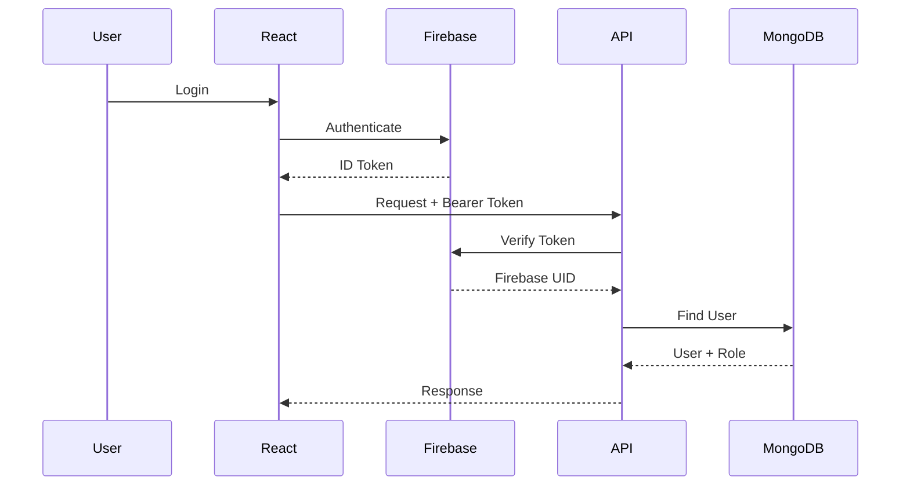
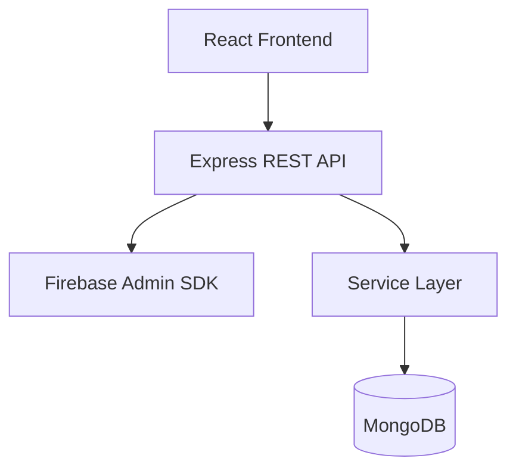
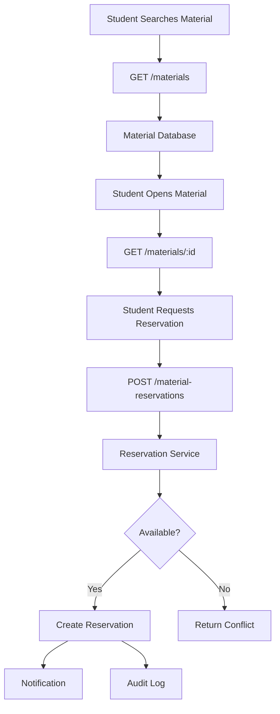
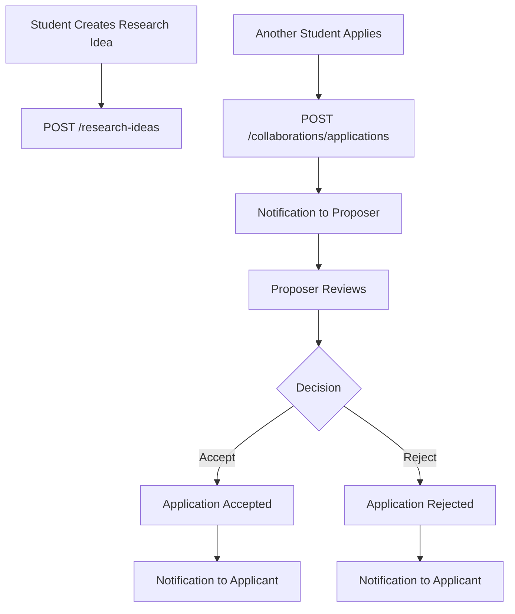
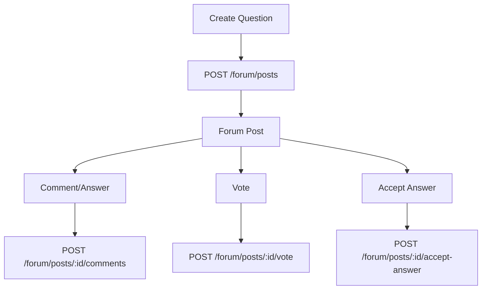

# CMRL Research Portal
## REST API Specification

**Project:** CMRL Research Portal  
**Laboratory:** CMRL — Crystalline Material Research Lab  
**API Version:** 1.0  
**Base Path:** `/api/v1`  
**Architecture:** REST API  
**Backend:** Node.js + Express + TypeScript  
**Database:** MongoDB + Mongoose  
**Authentication:** Firebase Authentication  
**Based On:** `PRD.md`, `ARCHITECTURE.md`, `DATABASE_SCHEMA.md`

---

# 1. API Overview

The CMRL Research Portal API provides the backend interface for:

- Authentication context
- Users
- Materials
- DFT properties
- Material reservations
- Research projects
- Publications
- Research ideas
- Collaboration
- Forum
- Notifications
- Research files
- Resources
- Announcements
- Achievements
- Administration
- Audit logs

The API follows REST principles and uses JSON for normal request and response bodies.

---

# 2. Base URL

All API endpoints are versioned.

```text
/api/v1
```

Example:

```text
GET /api/v1/materials
```

Production may eventually use:

```text
https://api.cmrl.example/api/v1
```

The actual production domain will be determined during deployment.

---

# 3. Authentication

Authentication is handled by Firebase Authentication.

The frontend obtains a Firebase ID token after login.

Authenticated API requests send:

```http
Authorization: Bearer <FIREBASE_ID_TOKEN>
```

The Express backend verifies the token using the Firebase Admin SDK.

---

# 4. Authentication Flow



---

# 5. Authentication Requirements

The backend must:

1. Verify Firebase ID tokens.
2. Extract Firebase UID.
3. Find the corresponding MongoDB user.
4. Check account status.
5. Attach authenticated user information to the request.
6. Apply role/permission checks where required.

Possible account states:

```text
PENDING
ACTIVE
SUSPENDED
INACTIVE
```

Suspended users must not access protected application functionality.

---

# 6. Public vs Protected Endpoints

Endpoints should be classified as:

### Public

No authentication required.

Examples:

```text
GET /materials
GET /materials/:id
GET /research-areas
GET /publications
GET /projects
GET /announcements
```

Only records marked as publicly visible should be returned.

### Authenticated

Requires a valid Firebase token.

### Role-protected

Requires a specific role.

Examples:

```text
ADMIN
SUPERVISOR
STUDENT
```

---

# 7. API Response Convention

Successful responses should use a consistent format.

Example:

```json id="q8m9g7"
{
  "success": true,
  "data": {
    "materialId": "CMRL-MAT-001",
    "name": "Example Material"
  }
}
```

For collections:

```json id="x2w5o3"
{
  "success": true,
  "data": [],
  "pagination": {
    "page": 1,
    "limit": 20,
    "total": 125,
    "totalPages": 7
  }
}
```

---

# 8. Error Response Convention

Errors should use:

```json id="6x3x8e"
{
  "success": false,
  "error": {
    "code": "MATERIAL_NOT_FOUND",
    "message": "The requested material was not found."
  }
}
```

Validation errors may include:

```json id="5x8w3j"
{
  "success": false,
  "error": {
    "code": "VALIDATION_ERROR",
    "message": "One or more fields are invalid.",
    "fields": {
      "formula": "Formula is required."
    }
  }
}
```

---

# 9. HTTP Status Codes

Use standard HTTP status codes.

| Status | Meaning |
|---|---|
| 200 | Successful request |
| 201 | Resource created |
| 204 | Successful request with no response body |
| 400 | Bad request |
| 401 | Authentication required/invalid |
| 403 | Insufficient permissions |
| 404 | Resource not found |
| 409 | Resource conflict |
| 422 | Validation error |
| 429 | Rate limit exceeded |
| 500 | Internal server error |

---

# 10. API Error Codes

Use machine-readable error codes.

Examples:

```text
AUTH_REQUIRED
INVALID_TOKEN
ACCOUNT_SUSPENDED
FORBIDDEN
RESOURCE_NOT_FOUND
VALIDATION_ERROR
DUPLICATE_RESOURCE
MATERIAL_NOT_FOUND
MATERIAL_ALREADY_RESERVED
RESERVATION_CONFLICT
INVALID_STATUS_TRANSITION
PROJECT_NOT_FOUND
FILE_ACCESS_DENIED
FILE_TOO_LARGE
INVALID_FILE_TYPE
USER_NOT_FOUND
APPLICATION_ALREADY_EXISTS
```

---

# 11. Pagination

Collection endpoints should support:

```text
?page=1&limit=20
```

Example:

```http
GET /api/v1/materials?page=2&limit=20
```

Recommended defaults:

```text
page = 1
limit = 20
```

Maximum limit should be enforced.

Example:

```text
limit <= 100
```

---

# 12. Sorting

Collection endpoints may support:

```text
?sort=createdAt
?sort=-createdAt
?sort=name
```

Example:

```http
GET /api/v1/materials?sort=-createdAt
```

Only approved sortable fields should be accepted.

Do not allow arbitrary MongoDB field expressions from the client.

---

# 13. Filtering

Filtering should use explicit query parameters.

Example:

```http
GET /api/v1/materials?status=AVAILABLE
```

Multiple filters:

```http
GET /api/v1/materials?status=AVAILABLE&crystalSystem=CUBIC
```

---

# 14. Search

Use:

```http
GET /api/v1/materials/search?q=LiTeH3
```

or:

```http
GET /api/v1/search?q=LiTeH3
```

For MVP, domain-specific search endpoints are preferred.

Future global search may use:

```text
GET /api/v1/search
```

---

# 15. Authentication Context Endpoints

## GET `/auth/me`

Returns the authenticated user's application profile.

### Authentication

Required.

### Response

```json id="r3y5k9"
{
  "success": true,
  "data": {
    "userId": "CMRL-USER-001",
    "role": "STUDENT",
    "accountStatus": "ACTIVE",
    "rank": "BEGINNER",
    "profile": {
      "fullName": "Example Student"
    }
  }
}
```

---

# 16. POST `/auth/sync`

Synchronizes a Firebase-authenticated user with MongoDB.

### Authentication

Required.

### Purpose

Called immediately after the first successful Firebase authentication to create or retrieve the MongoDB user document.

### Behavior

If the user does not exist in MongoDB:

1. Verify Firebase identity via Firebase Admin SDK.
2. Create a MongoDB user document with:
   - `role = STUDENT`
   - `rank = NEWBIE`
   - `accountStatus = PENDING`
3. Set Firebase custom claims: `{ role: "STUDENT" }`.
4. Return the new user profile.

If user already exists:

- Return the existing profile.

### Important

New users with `PENDING` status cannot access protected research functionality. A Supervisor or Admin must set `accountStatus = ACTIVE` before the user can use the research platform.

---

# 17. Users API

Base path:

```text
/api/v1/users
```

---

# 18. GET `/users/:userId`

Returns a user's public profile.

### Authentication

Public or authenticated depending on profile visibility.

### Restrictions

Private information must not be returned unless authorized.

---

# 19. PATCH `/users/me`

Updates the authenticated user's profile.

### Authentication

Required.

### Student may update

- Name
- Photo
- Date of birth
- Gender
- Batch
- Research interests
- Skills
- Software
- Programming languages
- External profiles
- Privacy settings

Certain fields such as:

- Role
- Rank
- Account status

must not be user-editable.

---

# 20. GET `/users`

Returns a paginated user directory.

### Authentication

Required.

### Query parameters

```text
?page=1
&limit=20
&batch=...
&researchArea=...
&rank=...
&search=...
```

---

# 21. GET `/users/:userId/projects`

Returns projects associated with a user.

---

# 22. GET `/users/:userId/publications`

Returns publications associated with a user.

---

# 23. GET `/users/:userId/materials`

Returns materials associated with a user through authorized research relationships.

---

# 24. Admin User Endpoints

Base:

```text
/api/v1/admin/users
```

### GET

List all users.

### PATCH

Update administrative information.

### PATCH `/:userId/status`

Change account status.

### PATCH `/:userId/role`

Change role.

### PATCH `/:userId/rank`

Change rank.

### DELETE

Deactivate/delete where permitted.

All require:

```text
ADMIN
```

---

# 25. Research Areas API

Base:

```text
/api/v1/research-areas
```

---

# 26. GET `/research-areas`

Returns active research areas.

Public.

---

# 27. GET `/research-areas/:id`

Returns a research area and associated public research.

---

# 28. POST `/research-areas`

Creates a research area.

### Role

ADMIN or SUPERVISOR.

---

# 29. PATCH `/research-areas/:id`

Updates a research area.

### Role

ADMIN or SUPERVISOR.

---

# 30. DELETE `/research-areas/:id`

Archives/deactivates a research area.

### Role

ADMIN.

Hard deletion should generally be avoided if existing research records reference the area.

---

# 31. Materials API

Base:

```text
/api/v1/materials
```

This is the most important API domain.

---

# 32. GET `/materials`

Returns a paginated list of materials.

### Public behavior

Only public materials are returned.

### Authenticated behavior

Additional CMRL-visible materials may be returned.

### Query parameters

```text
?page=1
&limit=20
&search=LiTeH3
&status=AVAILABLE
&crystalSystem=CUBIC
&spaceGroup=...
&researchArea=...
&researcher=...
&project=...
&materialCategory=...
&publicationStatus=...
&sort=-createdAt
```

---

# 33. GET `/materials/:materialId`

Returns complete material information according to access permissions.

### Example

```http
GET /api/v1/materials/CMRL-MAT-001
```

Response may include:

- Identity
- Crystal structure
- Research status
- Researchers
- Project
- Properties
- Progress
- Files
- Publications

Private information must be filtered according to authorization.

---

# 34. POST `/materials`

Creates a material record.

### Authentication

Required. The authenticated user must have `accountStatus = ACTIVE`.

### Behavior by role

- **Student**: Material is created with `status = PROPOSED`. The material enters `UNDER_REVIEW` workflow. A Supervisor or Admin must approve it before it becomes `AVAILABLE`.
- **Supervisor or Admin**: May create a material directly as `AVAILABLE`, or as `PROPOSED` if the review workflow is desired.

### Request

```json id="4k6n3w"
{
  "name": "Example Material",
  "formula": "LiTeH3",
  "elements": ["Li", "Te", "H"],
  "materialCategory": "COMPLEX_HYDRIDE",
  "researchAreas": [],
  "crystalStructure": {}
}
```

### Backend behavior

1. Verify `accountStatus = ACTIVE`.
2. Validate request.
3. Normalize formula.
4. Search for potential duplicates.
5. Set initial `status` based on user role (`PROPOSED` for students, `AVAILABLE` for supervisors/admins unless overridden).
6. Set default `visibility = CMRL_MEMBERS`.
7. Create material.
8. Create audit log entry.
9. Return material.

---

# 35. Duplicate Material Response

If potential duplicates are detected:

```http
409 Conflict
```

Example:

```json id="t8j3q0"
{
  "success": false,
  "error": {
    "code": "POTENTIAL_DUPLICATE_MATERIAL",
    "message": "Similar materials already exist.",
    "matches": [
      "CMRL-MAT-003",
      "CMRL-MAT-017"
    ]
  }
}
```

The UI should allow the researcher to inspect those records.

---

# 36. PATCH `/materials/:materialId`

Updates permitted material information.

### Permissions

Depends on:

- Ownership
- Project membership
- Supervisor role
- Admin role

### Important

Status changes should be handled by a dedicated endpoint rather than allowing arbitrary status modification.

---

# 37. PATCH `/materials/:materialId/status`

Changes material status.

### Request

```json id="1p5t4h"
{
  "status": "STUDYING",
  "reason": "Research has started."
}
```

### Backend must:

1. Verify authorization.
2. Verify current status.
3. Verify allowed transition.
4. Update material.
5. Record audit log.
6. Create notification if appropriate.

---

# 38. GET `/materials/:materialId/history`

Returns authorized research/activity history.

May include:

- Status changes
- Reservations
- Property updates
- Project changes
- Verification events

---

# 39. Material Property API

Base:

```text
/api/v1/materials/:materialId/properties
```

---

# 40. GET `/materials/:materialId/properties`

Returns properties for a material.

Filters:

```text
?category=ELECTRONIC
&status=COMPLETED
```

---

# 41. POST `/materials/:materialId/properties`

Creates a property record.

### Authentication

Required.

### Permissions

Researcher assigned to the material/project, Supervisor, or Admin.

---

# 42. PATCH `/materials/:materialId/properties/:propertyId`

Updates a property.

The backend must verify that the property belongs to the specified material.

---

# 43. PATCH `/materials/:materialId/properties/:propertyId/status`

Updates property status.

Example:

```json id="3q8m1x"
{
  "status": "COMPLETED"
}
```

---

# 44. POST `/materials/:materialId/properties/:propertyId/verify`

Marks a property as verified.

### Role

SUPERVISOR or authorized reviewer.

---

# 45. DELETE `/materials/:materialId/properties/:propertyId`

Deletes or archives a property.

### Role

SUPERVISOR/ADMIN unless special project permissions exist.

Scientific data should preferably be archived rather than permanently deleted.

---

# 46. Property Definitions API

Future/optional module:

```text
/api/v1/property-definitions
```

Purpose:

Manage standardized property types.

Examples:

```text
Band Gap
Bulk Modulus
Young's Modulus
Formation Energy
Phonon
Hydrogen Capacity
```

This can remain out of the MVP if necessary.

---

# 47. Material Reservation API

Base:

```text
/api/v1/material-reservations
```

---

# 48. POST `/material-reservations`

Creates a reservation request.

### Student request

```json id="a5e4r9"
{
  "material": "CMRL-MAT-001",
  "project": "CMRL-PROJ-001",
  "purpose": "Study electronic properties",
  "requestedStartDate": "2026-09-01",
  "expectedCompletionDate": "2026-11-01"
}
```

### Backend

Must check:

- Authentication
- Active account
- Material existence
- Material status
- Existing active reservation
- Project membership
- Date validity

---

# 49. GET `/material-reservations`

Returns reservations available to the authenticated user's role.

Students should normally see:

- Their own reservations
- Public reservation status where appropriate

Supervisors/Admins may see broader information.

---

# 50. GET `/material-reservations/:reservationId`

Returns reservation details.

---

# 51. PATCH `/material-reservations/:reservationId/approve`

Approves a reservation request.

### Role

- **Supervisor**: Primary approver for material reservations.
- **Admin**: Administrative override — may approve or reject any reservation.

### Backend must:

1. Verify the user is SUPERVISOR or ADMIN.
2. Verify the reservation exists and is in `REQUESTED` status.
3. Verify no other active reservation exists for the same material.
4. Approve the reservation.
5. Update material status to `RESERVED`.
6. Notify the requesting student.

---

# 52. PATCH `/material-reservations/:reservationId/reject`

Rejects a reservation.

Request:

```json id="r6c4g2"
{
  "reason": "Material is already assigned to another project."
}
```

---

# 53. PATCH `/material-reservations/:reservationId/cancel`

Cancels a reservation.

A student may cancel their own request if allowed.

---

# 54. PATCH `/material-reservations/:reservationId/complete`

Marks research reservation as completed.

---

# 55. Research Projects API

Base:

```text
/api/v1/projects
```

---

# 56. GET `/projects`

Returns projects visible to the user.

Filters:

```text
?status=ACTIVE
&researchArea=...
&supervisor=...
&student=...
```

---

# 57. GET `/projects/:projectId`

Returns project details.

Includes:

- Project information
- Supervisor
- Researchers
- Materials
- Publications
- Files
- Progress

---

# 58. POST `/projects`

Creates a project.

### Recommended permissions

SUPERVISOR/ADMIN.

Student-created projects may be implemented later through a proposal workflow.

---

# 59. PATCH `/projects/:projectId`

Updates project information.

---

# 60. PATCH `/projects/:projectId/status`

Changes project status.

Allowed transitions should be validated.

---

# 61. PATCH `/projects/:projectId/progress`

Updates progress.

Request:

```json id="m5q7x8"
{
  "progress": 75
}
```

Backend must ensure:

```text
0 <= progress <= 100
```

---

# 62. POST `/projects/:projectId/members`

Adds a researcher.

---

# 63. DELETE `/projects/:projectId/members/:userId`

Removes a researcher.

---

# 64. POST `/projects/:projectId/materials`

Associates a material with a project.

---

# 65. DELETE `/projects/:projectId/materials/:materialId`

Removes a material from a project if permitted.

---

# 66. GET `/projects/:projectId/publications`

Returns project publications.

---

# 67. Publications API

Base:

```text
/api/v1/publications
```

---

# 68. GET `/publications`

Returns publications.

Filters:

```text
?year=2026
&researchArea=...
&project=...
&material=...
&author=...
&status=PUBLISHED
```

Public users should only receive public publication records.

---

# 69. GET `/publications/:publicationId`

Returns publication details.

---

# 70. POST `/publications`

Creates a publication record.

### Permissions

SUPERVISOR/ADMIN or authorized researcher.

---

# 71. PATCH `/publications/:publicationId`

Updates publication metadata.

---

# 72. PATCH `/publications/:publicationId/status`

Changes publication status.

---

# 73. DELETE `/publications/:publicationId`

Archives/deletes a publication according to permissions.

Published research should normally not be hard-deleted.

---

# 74. Research Ideas API

Base:

```text
/api/v1/research-ideas
```

---

# 75. GET `/research-ideas`

Returns open research opportunities.

Filters:

```text
?status=OPEN
&researchArea=...
&skill=Python
```

---

# 76. GET `/research-ideas/:ideaId`

Returns a research idea.

---

# 77. POST `/research-ideas`

Creates a research idea.

### Authentication

Required.

---

# 78. PATCH `/research-ideas/:ideaId`

Updates an idea.

Only the proposer or authorized supervisor/admin may modify it.

---

# 79. PATCH `/research-ideas/:ideaId/status`

Changes idea status.

---

# 80. Collaboration API

Base:

```text
/api/v1/collaborations
```

---

# 81. POST `/collaborations/applications`

Applies to a research idea.

Request:

```json id="w5d8h4"
{
  "researchIdea": "CMRL-IDEA-001",
  "message": "I would like to contribute to the phonon calculations.",
  "relevantSkills": [
    "CASTEP",
    "DFT",
    "Python"
  ]
}
```

---

# 82. GET `/collaborations/applications`

Returns the user's relevant applications.

---

# 83. GET `/collaborations/applications/:applicationId`

Returns application details.

---

# 84. PATCH `/collaborations/applications/:applicationId/accept`

Accepts an application.

### Permission

Research idea proposer or authorized supervisor.

---

# 85. PATCH `/collaborations/applications/:applicationId/reject`

Rejects an application.

---

# 86. PATCH `/collaborations/applications/:applicationId/withdraw`

Applicant withdraws their application.

---

# 87. Forum API

Base:

```text
/api/v1/forum
```

---

# 88. GET `/forum/posts`

Returns forum posts.

Query:

```text
?page=1
&limit=20
&tag=DFT
&researchArea=...
&type=QUESTION
&sort=-createdAt
```

---

# 89. GET `/forum/posts/:postId`

Returns a forum post and its permitted comments.

---

# 90. POST `/forum/posts`

Creates a forum post.

Request:

```json id="p2j4s7"
{
  "title": "Why am I getting imaginary phonon modes?",
  "body": "Detailed question...",
  "type": "QUESTION",
  "tags": [
    "phonon",
    "DFT",
    "CASTEP"
  ]
}
```

---

# 91. PATCH `/forum/posts/:postId`

Updates own post where allowed.

---

# 92. DELETE `/forum/posts/:postId`

Soft-removes or deletes a post according to permissions.

---

# 93. POST `/forum/posts/:postId/comments`

Adds a comment/answer.

---

# 94. PATCH `/forum/comments/:commentId`

Edits own comment.

---

# 95. DELETE `/forum/comments/:commentId`

Removes a comment.

---

# 96. POST `/forum/posts/:postId/vote`

Vote request:

```json id="1q7r5z"
{
  "vote": 1
}
```

Possible values:

```text
1
-1
```

---

# 97. DELETE `/forum/posts/:postId/vote`

Removes the user's vote.

---

# 98. POST `/forum/posts/:postId/accept-answer`

Marks an answer as accepted.

### Permission

Question author or authorized moderator.

---

# 99. POST `/forum/posts/:postId/report`

Reports inappropriate content.

Request:

```json id="6w8x4s"
{
  "reason": "Spam"
}
```

---

# 100. Notifications API

Base:

```text
/api/v1/notifications
```

---

# 101. GET `/notifications`

Returns the authenticated user's notifications.

Query:

```text
?page=1
&limit=20
&unread=true
```

---

# 102. PATCH `/notifications/:notificationId/read`

Marks a notification as read.

---

# 103. PATCH `/notifications/read-all`

Marks all notifications as read.

---

# 104. DELETE `/notifications/:notificationId`

Deletes/archives a notification.

---

# 105. GET `/notifications/unread-count`

Returns:

```json id="u3t6k5"
{
  "success": true,
  "data": {
    "count": 4
  }
}
```

This endpoint can be polled by the frontend.

---

# 106. Research Files API

Base:

```text
/api/v1/files
```

---

# 107. POST `/files/upload`

Uploads a research file.

### Required

- Authentication
- Authorization
- File type validation
- File size validation
- Entity relationship validation

The actual binary file should be stored in object storage.

MongoDB stores metadata.

---

# 108. GET `/files/:fileId`

Returns file metadata and an authorized access mechanism.

For private files, the backend should generate a temporary signed URL.

---

# 109. DELETE `/files/:fileId`

Deletes/archives a file.

Permissions depend on:

- Ownership
- Project membership
- Supervisor
- Admin

---

# 110. POST `/files/:fileId/new-version`

Uploads a new version of a file.

---

# 111. Resources API

Base:

```text
/api/v1/resources
```

---

# 112. GET `/resources`

Returns public or authorized resources.

Filters:

```text
?category=DFT
&tag=CASTEP
&search=phonon
```

---

# 113. GET `/resources/:resourceId`

Returns resource details.

---

# 114. POST `/resources`

Creates a resource.

### Permission

Supervisor/Admin or authorized contributor.

---

# 115. PATCH `/resources/:resourceId`

Updates resource.

---

# 116. DELETE `/resources/:resourceId`

Archives/removes resource.

---

# 117. Announcements API

Base:

```text
/api/v1/announcements
```

---

# 118. GET `/announcements`

Returns active announcements.

Public announcements may be visible without authentication.

---

# 119. GET `/announcements/:announcementId`

Returns announcement details.

---

# 120. POST `/announcements`

Creates an announcement.

### Permission

ADMIN/SUPERVISOR.

---

# 121. PATCH `/announcements/:announcementId`

Updates an announcement.

---

# 122. DELETE `/announcements/:announcementId`

Archives/removes an announcement.

---

# 123. Achievements API

Base:

```text
/api/v1/achievements
```

---

# 124. GET `/achievements`

Returns public achievements.

---

# 125. POST `/achievements`

Creates an achievement.

### Permission

ADMIN/SUPERVISOR.

---

# 126. PATCH `/achievements/:achievementId`

Updates achievement.

---

# 127. DELETE `/achievements/:achievementId`

Archives achievement.

---

# 128. Dashboard API

Dashboards should not make dozens of independent API requests when a summary endpoint can efficiently provide the information.

---

# 129. GET `/dashboard/student`

Returns:

```text
My projects
My materials
Reservations
Notifications
Collaboration applications
Forum activity
Research progress
```

---

# 130. GET `/dashboard/supervisor`

Returns:

```text
Active projects
Researchers
Material assignments
Pending approvals
Research progress
Publications
Recent activity
```

---

# 131. GET `/dashboard/admin`

Returns:

```text
Users
Materials
Projects
Reservations
Publications
Forum reports
Collaboration activity
System activity
```

---

# 132. GET `/dashboard/research`

Returns public/general research statistics:

```text
Total materials
Materials by status
Materials by research area
Projects
Publications
Researchers
Research progress
```

---

# 133. Dashboard Aggregation

Dashboard endpoints should use MongoDB aggregation where appropriate.

The frontend should receive summary data rather than thousands of raw records.

---

# 134. Search API

Future global endpoint:

```text
GET /api/v1/search?q=LiTeH3
```

Response could group results:

```json id="e1f7y3"
{
  "success": true,
  "data": {
    "materials": [],
    "projects": [],
    "publications": [],
    "users": [],
    "forumPosts": [],
    "resources": []
  }
}
```

This may remain Phase 2.

---

# 135. Admin API

Base:

```text
/api/v1/admin
```

Administrative endpoints should include:

```text
/admin/users
/admin/materials
/admin/projects
/admin/publications
/admin/forum
/admin/collaborations
/admin/files
/admin/announcements
/admin/audit-logs
```

---

# 136. Admin Material Management

Examples:

```text
GET /admin/materials
PATCH /admin/materials/:id
PATCH /admin/materials/:id/status
PATCH /admin/materials/:id/blacklist
```

---

# 137. Admin Forum Moderation

Examples:

```text
GET /admin/forum/reports
PATCH /admin/forum/posts/:id/remove
PATCH /admin/forum/comments/:id/remove
PATCH /admin/users/:id/suspend
```

---

# 138. Audit API

Base:

```text
/api/v1/admin/audit-logs
```

### GET

Supports:

```text
?actor=...
&entityType=MATERIAL
&action=MATERIAL_STATUS_CHANGED
&from=...
&to=...
```

Only authorized administrators should access full audit logs.

---

# 139. File Upload API Security

The backend must verify:

- User identity
- User permission
- File size
- MIME type
- Extension
- Target material/project
- Access level

Never trust:

```text
Content-Type
```

alone.

The file should also be checked against allowed extensions and, where appropriate, actual file signatures.

---

# 140. API Validation

Use a schema validation library such as:

- Zod
- Joi
- Yup

Recommendation:

**Zod**

because the project is using TypeScript.

Validation should occur before business logic.

---

# 141. Material Creation Validation

At minimum:

```text
name → required
formula → required
elements → required
materialCategory → valid enum
researchAreas → valid IDs
```

Crystal structure fields should be validated when supplied.

---

# 142. Property Validation

Depending on property type:

### Scalar

Require numeric value.

### Text

Require string.

### Array

Require valid numeric/string array.

### Structured

Require appropriate schema.

Unit should be required where the property definition expects a unit.

---

# 143. Status Transition Validation

The API must not allow arbitrary status changes.

For example:

```text id="g8j5k3"
AVAILABLE → STUDYING
```

may be invalid if the material must first be reserved.

A service should explicitly define allowed transitions.

---

# 144. Material Status Transition Example

```text id="0p8g6m"
PROPOSED
 ↓
UNDER_REVIEW
 ↓
AVAILABLE
 ↓
RESERVED
 ↓
STUDYING
 ↓
COMPLETED
 ↓
PUBLISHED
```

Alternative:

```text id="l1n8w0"
STUDYING
 ↓
STRUCTURALLY_UNSTABLE
 ↓
BLACKLISTED
```

---

# 145. Transactional Operations

Use transactions when operations affect multiple collections.

Important example:

```text id="f8j5t4"
Reservation Approval

1. Verify material
2. Verify reservation
3. Update reservation
4. Update material status
5. Create notification
6. Create audit record
7. Commit
```

---

# 146. Notification Generation

Notifications should be generated from successful business operations.

Example:

```text id="v7d9s4"
Application accepted
      ↓
Collaboration Service
      ↓
Notification Service
      ↓
Create Notification
```

Do not let the frontend create trusted system notifications directly.

---

# 147. Authorization Matrix

| Endpoint Domain | Student | Supervisor | Admin |
|---|---:|---:|---:|
| Own profile | ✓ | ✓ | ✓ |
| User directory | ✓ | ✓ | ✓ |
| Create material | Configurable | ✓ | ✓ |
| Edit own research material | ✓ | ✓ | ✓ |
| Change material status | Limited | ✓ | ✓ |
| Verify property | — | ✓ | ✓ |
| Reserve material | ✓ | ✓ | ✓ |
| Approve reservation | — | ✓ | ✓ |
| Create project | Limited | ✓ | ✓ |
| Manage users | — | Limited | ✓ |
| Forum | ✓ | ✓ | ✓ |
| Forum moderation | — | ✓ | ✓ |
| Collaboration | ✓ | ✓ | ✓ |
| Manage announcements | — | ✓ | ✓ |
| Audit logs | — | Limited | ✓ |

---

# 148. Resource Ownership

Before modifying a resource, the backend should verify:

```text id="5p7c8a"
Is user owner?
       OR
Is user project supervisor?
       OR
Is user authorized supervisor?
       OR
Is user admin?
```

Do not simply check:

```text role === STUDENT
```

for every operation.

---

# 149. Rate Limiting

Rate-limit:

- Search
- Forum creation
- Comments
- Votes
- Collaboration applications
- Contact form
- File uploads
- Public API endpoints

More restrictive limits should be used for abuse-prone endpoints.

---

# 150. Public API Protection

Even public endpoints should have:

- Rate limiting
- Pagination
- Query validation
- Maximum result limits

Public does not mean unlimited.

---

# 151. API Security Rules

Never accept from the frontend:

```text
createdBy = arbitraryUser
```

The backend should derive ownership from the authenticated Firebase UID.

Similarly:

```text
role
accountStatus
verifiedBy
```

should not be blindly accepted from clients.

---

# 152. Important Backend Rule

The frontend can request:

```json id="4n0o7f"
{
  "status": "COMPLETED"
}
```

but the backend decides whether that transition is allowed.

The frontend is a user interface, not an authority.

---

# 153. API Versioning

Current:

```text
/api/v1
```

If breaking changes become necessary:

```text
/api/v2
```

Avoid breaking existing clients without versioning.

---

# 154. API Documentation

The API should eventually be documented using:

**OpenAPI / Swagger**

Recommended endpoint:

```text
/api/docs
```

This can be generated from the API specification.

---

# 155. API Testing

Every important API domain should have automated tests.

At minimum:

- Authentication
- Users
- Materials
- Properties
- Reservations
- Projects
- Publications
- Collaboration
- Forum
- Notifications
- Files
- Admin

---

# 156. Critical Integration Tests

## Reservation conflict

Two users request the same material simultaneously.

Expected:

> Only one receives an active reservation.

---

## Unauthorized status change

Student attempts an unauthorized material status transition.

Expected:

```text
403 Forbidden
```

---

## Private file

Unauthorized user requests a private project file.

Expected:

```text
403 Forbidden
```

---

## Suspended user

Suspended user attempts a protected API request.

Expected:

```text
403 Forbidden
```

---

# 157. API Folder Mapping

Recommended backend structure:

```text
src/
└── modules/
    ├── auth/
    ├── users/
    ├── researchAreas/
    ├── materials/
    ├── materialProperties/
    ├── reservations/
    ├── projects/
    ├── publications/
    ├── researchIdeas/
    ├── collaborations/
    ├── forum/
    ├── notifications/
    ├── files/
    ├── resources/
    ├── announcements/
    ├── achievements/
    └── admin/
```

Each module may contain:

```text
controller
service
repository
model
routes
validation
types
```

---

# 158. Recommended API Development Order

Implement APIs in this order:

### Phase 1

```text
/auth
/users
/research-areas
```

### Phase 2

```text
/materials
/material-properties
/material-reservations
```

### Phase 3

```text
/projects
/publications
/files
```

### Phase 4

```text
/dashboard
/notifications
```

### Phase 5

```text
/research-ideas
/collaborations
/forum
/resources
/announcements
```

### Phase 6

```text
/admin
/audit-logs
```

---

# 159. API Design Principles

The API must:

1. Be predictable.
2. Use consistent naming.
3. Validate every request.
4. Enforce authorization server-side.
5. Return consistent responses.
6. Use appropriate HTTP status codes.
7. Support pagination.
8. Support filtering.
9. Avoid exposing unnecessary private fields.
10. Keep business logic in services.
11. Preserve research data integrity.
12. Use transactions for critical multi-write operations.
13. Avoid trusting client-provided ownership or roles.
14. Remain compatible with future frontend changes.

---

# 160. API-to-Database Relationship



---

# 161. Core Research API Flow



---

# 162. Collaboration API Flow



---

# 163. Forum API Flow



---

# 164. API Documentation Boundary

This document defines the API contract conceptually.

The actual implementation should create:

```text
OpenAPI Specification
```

after the endpoint behavior is finalized.

The frontend should consume the API contract rather than depending on database implementation details.

---

# 165. Final API Architecture

The complete request chain is:

```text
Browser
   ↓
React
   ↓
Axios
   ↓
Firebase ID Token
   ↓
Express API
   ↓
Authentication Middleware
   ↓
Authorization Middleware
   ↓
Validation Middleware
   ↓
Controller
   ↓
Service
   ↓
Repository / Mongoose
   ↓
MongoDB
```

For files:

```text
Browser
   ↓
Express Authorization
   ↓
Object Storage
   ↓
File Metadata → MongoDB
```

---

# 166. Next Documentation Stage

The next document should be:

# `UI_UX_SPEC.md`

It should define the actual interface and user experience of CMRL Research Portal.

It should cover:

- Design system
- CMRL visual identity
- Color strategy
- Typography
- Navigation
- Responsive behavior
- Public pages
- Login/register
- Student dashboard
- Supervisor dashboard
- Admin dashboard
- Student profile
- Material database
- Material detail page
- DFT property tables
- Material reservation UI
- Research project UI
- Publication UI
- Forum
- Collaboration hub
- Notifications
- File repository
- Resources
- Search
- Empty/loading/error states
- Accessibility
- Mobile layouts
- Component hierarchy
- Page-by-page wireframe descriptions
- UX workflows

The UI/UX specification should be based directly on the **actual data and API architecture** defined in the previous documents.