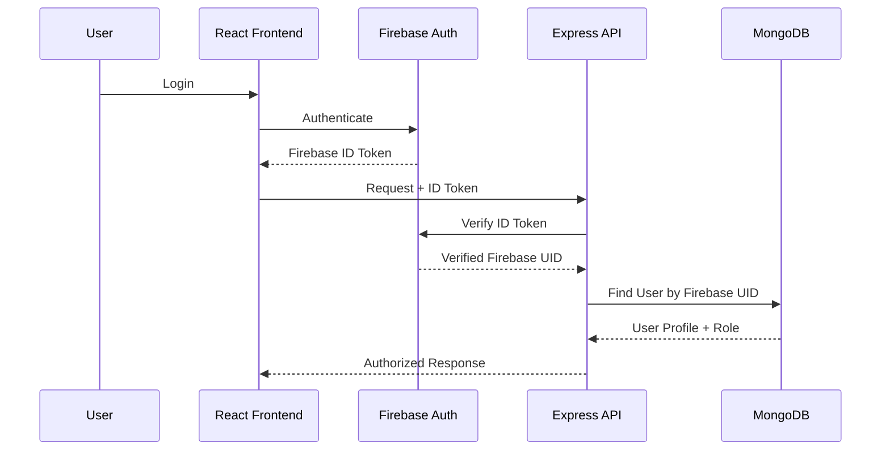
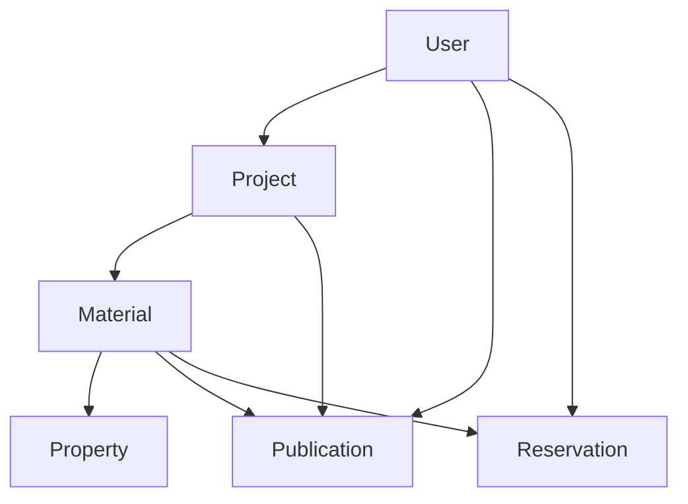
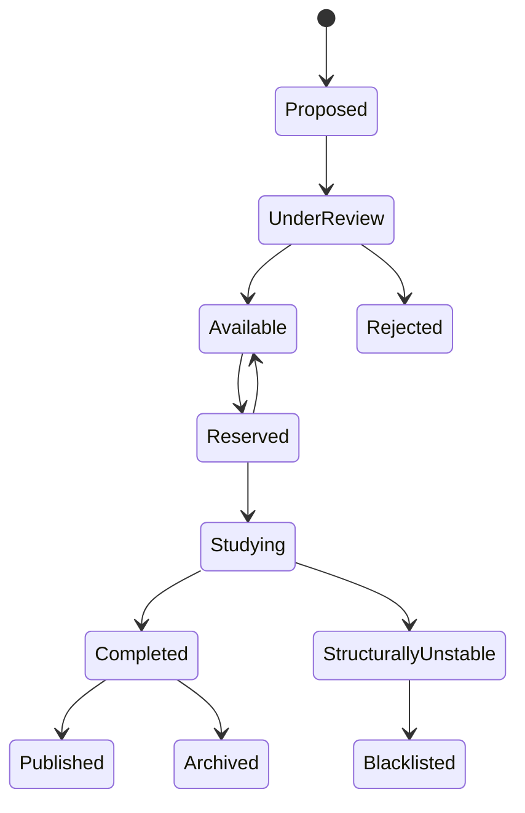
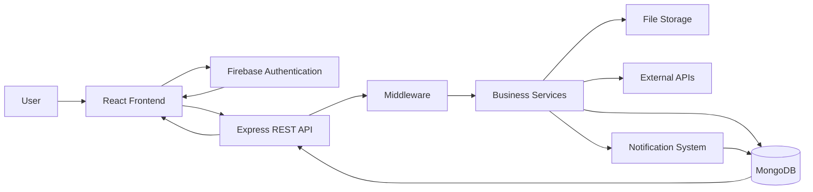
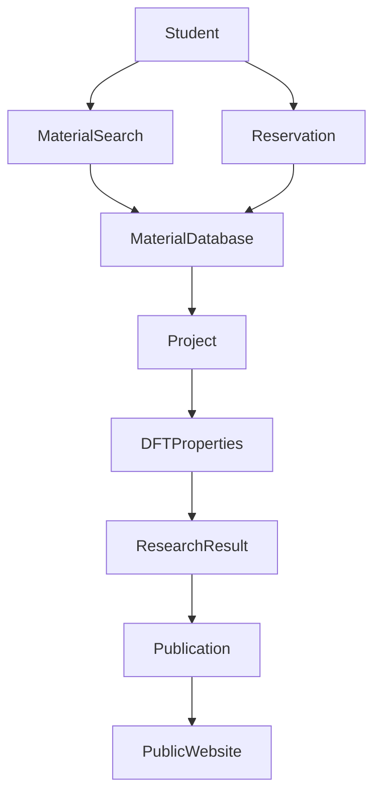

# CMRL Research Portal
## System Architecture Document

**Project:** CMRL Research Portal  
**Laboratory:** CMRL — Crystalline Material Research Lab  
**Architecture Version:** 1.0  
**Based On:** `PRD.md`  
**Technology Direction:** MERN + Vite React + Firebase Authentication  
**Architecture Style:** Modular Monolith + REST API  
**Primary Database:** MongoDB  
**Authentication:** Firebase Authentication

---

# 1. Architecture Overview

CMRL Research Portal will use a **modular monolithic architecture** for the initial version.

The system will consist of:

```text
┌─────────────────────────────────────────────────────────────┐
│                       CMRL USERS                            │
│                                                             │
│ Public Visitors | Students | Supervisor | Administrators  │
└─────────────────────────────┬───────────────────────────────┘
                              │
                              ▼
┌─────────────────────────────────────────────────────────────┐
│                    FRONTEND APPLICATION                     │
│                                                             │
│ React + Vite + TypeScript + Tailwind CSS                    │
│ React Router + Zustand + Axios                              │
└──────────────┬──────────────────────────────┬───────────────┘
               │                              │
               │ Authentication               │ API Requests
               ▼                              ▼
┌─────────────────────────┐       ┌───────────────────────────┐
│ Firebase Authentication │       │      Express API          │
│                         │       │                           │
│ Email / Password        │       │ Node.js + Express         │
│ Google Authentication   │       │ REST API                  │
└─────────────────────────┘       └─────────────┬─────────────┘
                                                │
                                                ▼
                                  ┌───────────────────────────┐
                                  │     Backend Services      │
                                  │                           │
                                  │ Auth                      │
                                  │ Users                     │
                                  │ Materials                 │
                                  │ Properties                │
                                  │ Projects                  │
                                  │ Publications              │
                                  │ Reservations              │
                                  │ Forum                     │
                                  │ Collaboration             │
                                  │ Notifications             │
                                  │ Files                     │
                                  │ Resources                 │
                                  │ Administration            │
                                  └─────────────┬─────────────┘
                                                │
                          ┌─────────────────────┼───────────────────┐
                          │                     │                   │
                          ▼                     ▼                   ▼
                  ┌───────────────┐     ┌──────────────┐   ┌───────────────┐
                  │   MongoDB     │     │ File Storage │   │ External APIs │
                  │               │     │              │   │               │
                  │ Application   │     │ CIF          │   │ ORCID         │
                  │ Data          │     │ POSCAR       │   │ Crossref      │
                  │               │     │ Figures      │   │ Future APIs   │
                  └───────────────┘     └──────────────┘   └───────────────┘
```

The architecture intentionally avoids microservices during the initial development stage.

---

# 2. Architectural Principles

The system should follow these principles.

## 2.1 Research Data First

The architecture should prioritize the integrity and discoverability of research data.

The most important entities are:

```text
Student
Project
Material
Property
Publication
```

These entities must remain properly connected.

---

## 2.2 Secure by Default

Authentication and authorization must be enforced at the backend.

The frontend should never be trusted to determine whether a user is an administrator.

---

## 2.3 Modular

The backend should be organized by business domain.

For example:

```text
materials
projects
publications
forum
collaborations
```

rather than putting all logic into generic controllers.

---

## 2.4 Extensible

The DFT property system must allow future properties without requiring a major redesign.

The same principle applies to:

- Research areas
- Material categories
- User roles
- Publication types
- Resources

---

## 2.5 Simple Enough for the MVP

The system should not start with:

- Microservices
- Kubernetes
- Event-driven infrastructure
- Complex distributed systems
- Multiple databases

These can be introduced later only if actual scale requires them.

---

# 3. Recommended Technology Stack

## Frontend

| Technology | Purpose |
|---|---|
| React | UI |
| Vite | Development/build tooling |
| TypeScript | Type safety |
| React Router | Routing |
| Tailwind CSS | Styling |
| TanStack Query | Server state management, caching, data fetching, mutations |
| React Context | Client-only global state (auth context, theme) |
| Axios | HTTP requests |
| React Hook Form | Forms |
| Zod | Client-side validation |
| Recharts or similar | Dashboard charts |

---

## Backend

| Technology | Purpose |
|---|---|
| Node.js | Runtime |
| Express.js | HTTP server |
| TypeScript | Type safety |
| Mongoose | MongoDB ODM |
| Firebase Admin SDK | Authentication verification |
| Zod/Joi | Request validation |
| Helmet | HTTP security |
| CORS | Cross-origin configuration |
| Rate limiter | Abuse protection |
| Pino/Winston | Logging |

---

## Database

**MongoDB**

MongoDB will store application data.

---

## Authentication

**Firebase Authentication**

Supported:

- Email/password
- Google login

---

## File Storage

Use dedicated object/file storage rather than MongoDB for large files.

**Chosen Provider: Firebase Storage**

Firebase Storage is the selected file storage provider because:

- Firebase Authentication is already part of the stack.
- Firebase Storage integrates naturally within the Firebase project.
- Firebase Security Rules can be applied at the storage level.
- Reduces the number of external service dependencies for MVP.

MongoDB stores **file metadata and storage references only**. Binary file content is stored in Firebase Storage.

Future migration to AWS S3 or Cloudflare R2 is possible by replacing the storage service layer without changing the API contract.

---

# 4. Frontend Architecture

The frontend should follow a feature-oriented structure.

Recommended structure:

```text
client/
│
├── src/
│   │
│   ├── app/
│   │   ├── router/
│   │   ├── providers/
│   │   └── config/
│   │
│   ├── assets/
│   │
│   ├── components/
│   │   ├── ui/
│   │   ├── layout/
│   │   ├── forms/
│   │   ├── tables/
│   │   ├── charts/
│   │   └── common/
│   │
│   ├── features/
│   │   ├── auth/
│   │   ├── users/
│   │   ├── materials/
│   │   ├── properties/
│   │   ├── projects/
│   │   ├── publications/
│   │   ├── reservations/
│   │   ├── forum/
│   │   ├── collaborations/
│   │   ├── notifications/
│   │   ├── files/
│   │   ├── resources/
│   │   └── admin/
│   │
│   ├── pages/
│   │   ├── public/
│   │   ├── student/
│   │   ├── supervisor/
│   │   └── admin/
│   │
│   ├── hooks/
│   ├── lib/
│   ├── services/
│   ├── stores/
│   ├── types/
│   ├── utils/
│   └── main.tsx
│
└── package.json
```

The exact structure can evolve, but business features should remain separated.

---

# 5. Frontend Routing

Use React Router.

Conceptual route structure:

```text
/
├── /about
├── /supervisor
├── /research
├── /research-areas
├── /materials
├── /materials/:materialId
├── /projects
├── /projects/:projectId
├── /publications
├── /achievements
├── /alumni
├── /resources
├── /contact
│
├── /login
├── /register
├── /forgot-password
│
├── /dashboard
├── /profile
├── /projects/my
├── /materials/my
├── /reservations
├── /collaborations
├── /forum
├── /notifications
│
└── /admin/*
```

Public and authenticated routes must be clearly separated.

---

# 6. Route Protection

Create route guards based on:

1. Authentication
2. Account status
3. Role
4. Resource ownership where required

Conceptually:

```text
Public Route
      │
      ├── No authentication required
      │
      ▼
Authenticated Route
      │
      ├── Firebase authentication
      │
      ▼
Role Protected Route
      │
      ├── Student
      ├── Supervisor
      └── Admin
```

However, route protection on the frontend is only a UX mechanism.

The backend must independently verify authorization.

---

# 7. Authentication Architecture

Authentication flow:



---

# 8. Firebase Authentication Responsibilities

Firebase is responsible for:

- User authentication
- Password management
- Google authentication
- Email verification
- Authentication tokens

Firebase should NOT be treated as the primary application database.

---

# 9. MongoDB User Responsibilities

MongoDB stores:

- Firebase UID
- Name
- Profile image
- Academic information
- Research interests
- Role
- Rank
- Privacy settings
- External profiles
- Research relationships
- Account status

The detailed schema will be defined in `DATABASE_SCHEMA.md`.

---

# 10. Backend Architecture

Recommended backend structure:

```text
server/
│
├── src/
│   │
│   ├── config/
│   │
│   ├── middleware/
│   │   ├── auth/
│   │   ├── authorization/
│   │   ├── validation/
│   │   ├── error/
│   │   └── security/
│   │
│   ├── modules/
│   │   ├── auth/
│   │   ├── users/
│   │   ├── materials/
│   │   ├── properties/
│   │   ├── projects/
│   │   ├── publications/
│   │   ├── reservations/
│   │   ├── forum/
│   │   ├── collaborations/
│   │   ├── notifications/
│   │   ├── files/
│   │   ├── resources/
│   │   ├── announcements/
│   │   └── admin/
│   │
│   ├── services/
│   ├── utils/
│   ├── types/
│   ├── app.ts
│   └── server.ts
│
└── package.json
```

---

# 11. Backend Module Structure

Each major module should ideally contain:

```text
materials/
├── material.controller.ts
├── material.service.ts
├── material.repository.ts
├── material.model.ts
├── material.routes.ts
├── material.validation.ts
└── material.types.ts
```

For simpler modules, some files may be combined.

The architecture should not enforce unnecessary boilerplate.

---

# 12. Controller Layer

Controllers should be responsible for:

- Receiving HTTP requests
- Reading validated input
- Calling services
- Returning HTTP responses

Controllers should NOT contain complex business logic.

Bad:

```text
Controller
 ├── validate
 ├── calculate business rules
 ├── update multiple entities
 ├── send notification
 └── construct database queries
```

Better:

```text
Controller
    ↓
Service
    ↓
Repository / Model
```

---

# 13. Service Layer

Services contain business logic.

Examples:

```text
MaterialService
ReservationService
ProjectService
CollaborationService
NotificationService
PublicationService
```

Example:

```text
Reserve Material
      ↓
Check Material
      ↓
Check Current Reservation
      ↓
Validate Student
      ↓
Create Reservation
      ↓
Update Material Status
      ↓
Create Notification
      ↓
Return Result
```

---

# 14. Repository / Data Access Layer

A repository layer may be used for complex database operations.

Its purpose is to keep MongoDB queries away from business logic.

Example:

```text
ReservationService
        ↓
ReservationRepository
        ↓
MongoDB
```

For very simple CRUD operations, direct Mongoose usage inside a service may be acceptable.

Do not create abstraction purely for abstraction's sake.

---

# 15. API Architecture

The system will use a versioned REST API.

Base URL concept:

```text
/api/v1
```

Major domains:

```text
/api/v1/auth
/api/v1/users
/api/v1/materials
/api/v1/material-properties
/api/v1/projects
/api/v1/publications
/api/v1/reservations
/api/v1/forum
/api/v1/collaborations
/api/v1/notifications
/api/v1/files
/api/v1/resources
/api/v1/announcements
/api/v1/admin
```

Detailed endpoints will be defined later in `API_SPEC.md`.

---

# 16. API Request Flow

```text
React
  ↓
Axios
  ↓
HTTP Request
  ↓
Express Router
  ↓
Authentication Middleware
  ↓
Authorization Middleware
  ↓
Validation Middleware
  ↓
Controller
  ↓
Service
  ↓
Repository / Mongoose
  ↓
MongoDB
  ↓
Service
  ↓
Controller
  ↓
JSON Response
  ↓
React
```

---

# 17. Authentication Middleware

Every protected API request should carry a Firebase ID token.

Conceptually:

```text
Authorization: Bearer <Firebase-ID-Token>
```

The middleware should:

1. Extract token.
2. Verify token through Firebase Admin SDK.
3. Extract Firebase UID and custom claims (role) from the verified token.
4. Find the corresponding MongoDB user document by Firebase UID.
5. Verify that `accountStatus` is `ACTIVE`. Return `403 Forbidden` if `PENDING` or `SUSPENDED`.
6. Attach the full authenticated user context (MongoDB user document + role) to the request.
7. Continue.

MongoDB is the authoritative source for role and account status. Custom claims provide an efficiency reference but the role from the MongoDB user document governs all authorization decisions.

If token verification fails:

```text
401 Unauthorized
```

---

# 18. Authorization Middleware

Authorization should verify:

- User role
- Account status
- Resource ownership
- Required permissions

Possible permissions:

```text
materials.read
materials.create
materials.update
materials.delete
materials.reserve
projects.create
projects.manage
users.manage
forum.moderate
files.manage
```

The initial implementation can use role-based permissions, while a more granular permission system can be added later.

---

# 19. Role Model

MVP roles:

```text
STUDENT
SUPERVISOR
ADMIN
```

Potential future roles (not in MVP):

```text
ALUMNI
COLLABORATOR
GUEST_RESEARCHER
```

Roles are stored in MongoDB as the **source of truth**.

**Firebase Custom Claims**: Firebase custom claims will be used to carry the user's high-level role (`STUDENT`, `SUPERVISOR`, `ADMIN`). This allows authorization checks to reference the verified token without an additional database lookup in performance-critical paths.

Important constraints:

- MongoDB is the canonical source of role data. Custom claims are a synchronized cache.
- When a user's role is changed in MongoDB (e.g., by an Admin), the backend must immediately update the user's Firebase custom claims via the Firebase Admin SDK.
- Student rank is **not** stored in custom claims. Rank is application data in MongoDB only and must never be used as an authorization mechanism.
- If custom claims and MongoDB role are ever out of sync, MongoDB takes precedence.

---

# 20. Account Status

Users should have an account status such as:

```text
PENDING
ACTIVE
SUSPENDED
INACTIVE
```

Typical workflow:

```text
Registration
    ↓
PENDING
    ↓
Admin Approval
    ↓
ACTIVE
```

Depending on project policy, verified institutional email may automatically activate an account.

---

# 21. Research Domain Architecture

The core research relationship is:



This creates the central research graph:

```text
Researcher
    ↓
Project
    ↓
Material
    ↓
DFT Properties
    ↓
Research Result
    ↓
Publication
```

---

# 22. Material Domain

The material module will manage:

- Material identity
- Structure information
- Research status
- Researchers
- Projects
- Properties
- Reservations
- Files
- Publications
- Research history

The material module should not directly own unrelated forum or collaboration functionality.

---

# 23. Material Property Architecture

The property architecture must support variable research properties.

Avoid creating a Material model containing hundreds of mandatory fields like:

```text
material.bandGap
material.bulkModulus
material.phonon
material.absorption
...
```

This becomes difficult to maintain.

Instead, properties should be represented using a flexible architecture.

Conceptually:

```text
Material
   │
   ├── Structural Properties
   ├── Electronic Properties
   ├── Mechanical Properties
   ├── Thermodynamic Properties
   ├── Optical Properties
   ├── Magnetic Properties
   └── Hydrogen Storage Properties
```

The exact MongoDB implementation will be defined in `DATABASE_SCHEMA.md`.

---

# 24. Material Lifecycle Architecture

Material status changes should be controlled by business rules.

Example:



Not every user can trigger every transition.

---

# 25. Reservation Architecture

The reservation system must enforce a unique active reservation per material.

Conceptually:

```text
Student
   ↓
Reservation Request
   ↓
Reservation Service
   ↓
Check Material
   ↓
Check Existing Reservation
   ↓
Approval Rules
   ↓
Reservation Created
   ↓
Material Availability Updated
   ↓
Notification Created
```

Race conditions must be considered.

Two students attempting to reserve the same material at nearly the same time must not both receive successful active reservations.

Database-level constraints/transactions should be considered.

---

# 26. Project Architecture

Projects connect:

```text
Supervisor
     │
     ↓
Research Project
     │
     ├── Students
     ├── Materials
     ├── Publications
     ├── Files
     └── Research Progress
```

The project module manages:

- Project lifecycle
- Membership
- Materials
- Progress
- Publications
- Files

---

# 27. Publication Architecture

Publications should be linked rather than duplicated.

A publication can connect to:

```text
Publication
 ├── Authors
 ├── Projects
 └── Materials
```

This allows a user viewing a material to see:

> "This material contributed to these publications."

Similarly, a project can show:

> "This project produced these publications."

---

# 28. Student Architecture

Student profile information should remain separate from research activity.

Conceptually:

```text
User
 ├── Profile
 ├── Academic Information
 ├── Research Interests
 ├── Projects
 ├── Materials
 ├── Publications
 ├── Forum Activity
 └── Collaborations
```

Do not embed large research histories directly into the User document.

Use relationships to other collections.

---

# 29. Forum Architecture

Forum should be an independent module.

Conceptually:

```text
ForumPost
    │
    ├── Author
    ├── Tags
    ├── Comments
    ├── Votes
    └── Accepted Answer
```

Forum functionality should not be tightly coupled to the material database.

However, posts may optionally reference:

- Material
- Project
- Research area

This allows a user to ask:

> Why is CMRL-MAT-001 showing imaginary phonon modes?

without duplicating the material information.

---

# 30. Collaboration Architecture

The collaboration system contains:

```text
Research Idea
     │
     ├── Proposer
     ├── Research Area
     ├── Required Skills
     └── Applications
              │
              ├── Applicant
              ├── Status
              └── Message
```

Applications should have independent lifecycle states.

---

# 31. Notification Architecture

Notifications should be event-driven at the application level.

For example:

```text
Collaboration Application Created
             ↓
Collaboration Service
             ↓
Notification Service
             ↓
Notification Record
             ↓
Student Notification Center
```

Initially notifications can be stored in MongoDB.

Future real-time delivery may use:

```text
Socket.IO
```

or another real-time technology.

---

# 32. File Architecture

Files should not be stored directly inside MongoDB.

Instead:

```text
User
  ↓
Upload Request
  ↓
Backend Authorization
  ↓
Object Storage
  ↓
File Metadata → MongoDB
```

MongoDB stores:

- File name
- Storage key
- File type
- Size
- Owner
- Related entity
- Access level
- Version
- Upload timestamp

The actual binary file remains in object storage.

---

# 33. File Access Flow

For private files:

```text
User
 ↓
Request File
 ↓
Backend Authentication
 ↓
Authorization
 ↓
Check File Access
 ↓
Generate Signed URL
 ↓
User Downloads
```

Avoid exposing permanent public storage URLs for sensitive research files.

---

# 34. Research File Permissions

Initial access levels:

```text
PUBLIC
CMRL_MEMBERS
PROJECT_MEMBERS
SUPERVISOR_ONLY
ADMIN_ONLY
```

File access should be determined by:

- File access level
- User role
- Project membership
- Ownership
- Administrative override

---

# 35. Dashboard Architecture

Different dashboards should consume different API views.

## Student Dashboard

```text
My Projects
My Materials
Reservations
Notifications
Collaboration Applications
Forum Activity
Research Progress
```

## Supervisor Dashboard

```text
Active Projects
Students
Material Assignments
Pending Reviews
Research Progress
Publications
```

## Admin Dashboard

```text
Users
Materials
Projects
System Activity
Reports
Moderation
Announcements
```

Avoid sending the entire database to the frontend.

Dashboard APIs should return summarized data.

---

# 36. Research Analytics

Analytics should be calculated from research data.

Examples:

```text
Materials by Status
Materials by Research Area
Projects by Status
Properties Completed
Publications by Year
Research Activity
```

For large datasets, use:

- Aggregation pipelines
- Cached statistics
- Precomputed summaries where necessary

---

# 37. Global Search Architecture

For MVP:

```text
React Search
      ↓
Search API
      ↓
MongoDB indexes
      ↓
Search Results
```

Search should eventually cover:

- Materials
- Projects
- Publications
- Students
- Forum
- Resources

A dedicated search engine can be introduced later.

---

# 38. Database Indexing Strategy

Important indexes will likely be required for:

- Firebase UID
- Material ID
- Chemical formula
- Material status
- Research area
- Project ID
- User ID
- Reservation status
- Notification recipient
- Publication DOI
- Forum tags
- Created timestamps

The exact indexes will be specified in `DATABASE_SCHEMA.md`.

---

# 39. API Error Architecture

Use consistent HTTP status codes.

Examples:

```text
200 OK
201 Created
204 No Content
400 Bad Request
401 Unauthorized
403 Forbidden
404 Not Found
409 Conflict
422 Unprocessable Entity
429 Too Many Requests
500 Internal Server Error
```

Example response structure:

```json
{
  "success": false,
  "error": {
    "code": "MATERIAL_ALREADY_RESERVED",
    "message": "This material is currently reserved."
  }
}
```

The exact API response specification will be defined in `API_SPEC.md`.

---

# 40. Validation Architecture

Validation should happen at multiple levels.

```text
Frontend Validation
       ↓
Backend Validation
       ↓
Business Rules
       ↓
Database Constraints
```

Frontend validation improves UX.

Backend validation provides security.

Database constraints protect data integrity.

---

# 41. Security Architecture

The system should use:

```text
HTTPS
 ↓
Firebase Authentication
 ↓
Token Verification
 ↓
Role Authorization
 ↓
Input Validation
 ↓
Business Logic
 ↓
Database
```

Security controls include:

- Helmet
- CORS
- Rate limiting
- Input sanitization
- Request validation
- Secure headers
- Environment variables
- File validation
- Authentication token verification
- Authorization checks
- Audit logging

---

# 42. Environment Configuration

Secrets must never be committed to Git.

Backend environment variables may include:

```text
MONGODB_URI
FIREBASE_PROJECT_ID
FIREBASE_CLIENT_EMAIL
FIREBASE_PRIVATE_KEY
STORAGE_BUCKET
JWT/OTHER SERVICE SECRETS
```

Frontend should only receive variables that are safe to expose.

Firebase client configuration values are generally intended for frontend use, but security must still be enforced through Firebase rules and backend authorization.

---

# 43. CORS Architecture

Only approved frontend origins should access the production API.

Development:

```text
localhost
```

Production:

```text
CMRL frontend domain
```

Do not use unrestricted:

```text
Access-Control-Allow-Origin: *
```

for authenticated production APIs.

---

# 44. Rate Limiting

Rate limits should be stricter for:

- Login-related endpoints if proxied through backend
- Registration
- Forum posting
- File uploads
- Collaboration creation
- Search
- Public contact forms

The exact limits can be tuned after deployment.

---

# 45. Logging

Backend logs should include:

- Request ID
- HTTP method
- Route
- Response status
- Duration
- Error information

Do not log:

- Passwords
- Firebase tokens
- Private file URLs
- Sensitive personal data

---

# 46. Audit Logging

Audit logs are different from technical server logs.

Technical logs answer:

> "What happened to the server?"

Audit logs answer:

> "Who changed the material?"

Example:

```text
User: CMRL-USER-023
Action: MATERIAL_STATUS_CHANGED
Entity: CMRL-MAT-017
Old Status: Studying
New Status: Completed
Timestamp: ...
```

Audit logs should be immutable to ordinary users.

---

# 47. Caching Strategy

Caching should be introduced selectively.

Good candidates:

- Public research areas
- Public publications
- Public statistics
- Resources
- Frequently viewed material information

Do not aggressively cache rapidly changing information such as:

- Reservations
- Notifications
- User permissions

---

# 48. Concurrency

The system must consider concurrent operations.

Important examples:

### Material reservation

Two students attempting to reserve the same material.

### Material status

Two users attempting to update the same material.

### File versions

Two users uploading a new version simultaneously.

### Project membership

Two administrators modifying membership.

Use database-level safeguards where required.

---

# 49. Transaction Strategy

MongoDB transactions should be used when multiple related writes must succeed or fail together.

Example:

```text
Create Reservation
+
Update Material Status
+
Create Notification
```

If these operations must remain consistent, they should be performed transactionally where supported by the deployment.

---

# 50. Data Ownership

Every major research object should have clear ownership.

Examples:

```text
Material
→ Project / Research Group

Research Idea
→ Creator

Forum Post
→ Author

File
→ Uploader / Project

Publication
→ Research Group / Authors
```

Ownership does not automatically imply permission to delete or publish.

---

# 51. Public vs Private Architecture

The platform should conceptually have:

```text
PUBLIC DATA
     │
     ├── About
     ├── Publications
     ├── Selected Materials
     ├── Research Areas
     └── Achievements

PRIVATE DATA
     │
     ├── Personal information
     ├── Unpublished research
     ├── Private files
     ├── Internal notes
     └── Internal discussions
```

Every resource should have an explicit visibility policy.

---

# 52. Content Management

The public website should not require code changes for every minor content update.

Admin-managed content may include:

- Announcements
- Resources
- Research areas
- Selected homepage items
- Achievements

Static structural content can remain in the frontend.

---

# 53. 3D Crystal Visualization Architecture

This should be treated as a future module.

Potential flow:

```text
Material
 ↓
CIF File
 ↓
Parser
 ↓
Crystal Structure Model
 ↓
3D Renderer
 ↓
Interactive Viewer
```

Potential technologies:

- Three.js
- React Three Fiber
- Dedicated crystallographic visualization libraries

The viewer should support:

- Rotation
- Zoom
- Pan
- Unit cell
- Atoms
- Bonds
- Labels

Do not make the 3D viewer a dependency of the MVP.

---

# 54. External Research Database Architecture

Future external integrations may include:

- ORCID
- Crossref
- Google Scholar where technically feasible
- Materials Project
- NOMAD
- PubChem
- Crystallography databases

External data should not automatically overwrite CMRL's own research records.

Use:

```text
External Data
      ↓
Import / Review
      ↓
CMRL Record
```

rather than:

```text
External API
      ↓
Automatic Database Overwrite
```

---

# 55. Deployment Architecture

A simple initial deployment:

```text
                     Internet
                        │
                        ▼
              ┌──────────────────┐
              │ Frontend Hosting │
              │ React + Vite     │
              └────────┬─────────┘
                       │
                       ▼
              ┌──────────────────┐
              │ Backend Hosting  │
              │ Node + Express   │
              └────────┬─────────┘
                       │
             ┌─────────┴─────────┐
             ▼                   ▼
      ┌─────────────┐    ┌──────────────┐
      │  MongoDB    │    │ File Storage │
      └─────────────┘    └──────────────┘
```

Firebase Authentication operates independently alongside this architecture.

---

# 56. Recommended Deployment Components

A practical deployment can use:

### Frontend

- Vercel
- Netlify
- Firebase Hosting

### Backend

- Render
- Railway
- Fly.io
- VPS

### Database

- MongoDB Atlas

### Authentication

- Firebase

### File storage

- Firebase Storage
- Cloudflare R2
- AWS S3

The final choice should prioritize cost and reliability.

---

# 57. CI/CD

Use GitHub as the source repository.

Recommended workflow:

```text
Developer
   ↓
Git branch
   ↓
Pull Request
   ↓
Automated Tests
   ↓
Code Review
   ↓
Merge
   ↓
Deployment
```

At minimum, production deployment should be triggered from the main branch.

---

# 58. Git Branch Strategy

A simple strategy is recommended:

```text
main
develop
feature/*
fix/*
```

Example:

```text
feature/material-database
feature/material-reservation
feature/forum
fix/auth-redirect
```

Avoid overly complicated Git workflows.

---

# 59. Development Environments

Use separate environments:

```text
Development
Staging
Production
```

At minimum:

- Local development database
- Production database

A staging environment can be introduced before the first public deployment.

---

# 60. Backup Strategy

MongoDB backups should be configured.

Important research data includes:

- Materials
- Properties
- Projects
- Publications
- Users
- Audit logs

File storage should have its own backup/version strategy.

Research files should not exist only on the CMRL website.

---

# 61. Disaster Recovery

The system should be able to recover from:

- Database corruption
- Accidental deletion
- Deployment failure
- File loss
- Security incidents

At minimum:

- Database backups
- File versioning
- Git source control
- Environment configuration backups
- Documented recovery process

---

# 62. Scalability Strategy

Initial architecture:

```text
Modular Monolith
```

If usage grows significantly:

```text
Modular Monolith
       ↓
Identify bottleneck
       ↓
Extract specific service
```

Potential future services:

- Search
- File processing
- Notifications
- Analytics
- Scientific data processing

Do not prematurely split the application.

---

# 63. Performance Architecture

Frontend:

- Lazy routes
- Code splitting
- Image optimization
- Pagination
- Virtualized tables when necessary

Backend:

- Database indexing
- Pagination
- Efficient aggregation
- Response compression
- Caching where appropriate

Database:

- Proper indexes
- Query optimization
- Avoid unnecessary population
- Avoid massive documents

Storage:

- CDN/object storage
- Signed URLs
- Streaming for large files

---

# 64. Large Material Database Strategy

The frontend should never request:

```text
GET /materials
```

and receive thousands of complete material documents.

Instead:

```text
GET /materials?page=1&limit=20
```

List views should return only summary fields.

Full material information should be requested only when opening a detail page.

---

# 65. API Pagination

Pagination should be standardized.

Possible format:

```json
{
  "data": [],
  "pagination": {
    "page": 1,
    "limit": 20,
    "total": 1350,
    "totalPages": 68
  }
}
```

Cursor pagination can be introduced later for high-volume feeds.

---

# 66. Frontend Data Fetching

The frontend should separate:

- Server state
- Client state
- UI state

Server state includes:

- Materials
- Projects
- Publications
- Notifications

Client state includes:

- Authentication context
- User interface preferences
- Selected filters
- Modal state

For larger applications, a server-state library such as TanStack Query should be considered.

### Recommendation

Use:

**Zustand → client/global state**

**TanStack Query → server state**

This is preferable to putting API data into Zustand unnecessarily.

---

# 67. Recommended Frontend State Architecture

```text
                 React
                   │
        ┌──────────┴──────────┐
        │                     │
        ▼                     ▼
     Zustand            TanStack Query
        │                     │
        │              Server/API Data
        │
   UI / Auth / Local
```

This keeps responsibilities clear.

---

# 68. Design System Architecture

Create reusable UI primitives:

```text
Button
Input
Select
Modal
Dialog
Badge
Card
Table
Tabs
Dropdown
Tooltip
Pagination
Alert
Toast
Avatar
Progress
Skeleton
```

Then compose feature-specific components from these primitives.

---

# 69. Material UI Architecture

The material interface should have reusable components:

```text
MaterialCard
MaterialStatusBadge
MaterialSearch
MaterialFilters
MaterialPropertyTable
PropertyStatusBadge
MaterialProgress
MaterialResearchers
MaterialFiles
MaterialPublications
```

This prevents repeated UI implementation.

---

# 70. Dashboard Component Architecture

Reusable dashboard components:

```text
StatCard
ResearchChart
ActivityFeed
RecentMaterials
ProjectProgress
NotificationPanel
QuickActions
```

---

# 71. Error and Loading States

Every major data-driven page must handle:

```text
Loading
Empty
Error
Success
```

Example:

```text
Loading:
Skeleton

Empty:
"No materials found."

Error:
"Unable to load materials. Try again."

Success:
Material list
```

---

# 72. Accessibility Architecture

Accessibility should be considered at component level.

Reusable components must support:

- Keyboard navigation
- Focus management
- Screen readers
- ARIA labels where appropriate
- Accessible modal behavior

Accessibility should not be added only at the end.

---

# 73. Monitoring

Production monitoring should eventually track:

- API errors
- Frontend errors
- Database performance
- Server uptime
- File upload failures

Possible future tools:

- Sentry
- Better Stack
- UptimeRobot
- Platform-native monitoring

---

# 74. Architecture Decision Summary

| Decision | Recommendation |
|---|---|
| Frontend | React + Vite |
| Language | TypeScript |
| CSS | Tailwind CSS |
| Routing | React Router |
| Client state | Zustand |
| Server state | TanStack Query |
| HTTP | Axios |
| Backend | Node.js + Express |
| API | REST |
| Database | MongoDB |
| ODM | Mongoose |
| Authentication | Firebase Auth |
| File storage | Firebase Storage / S3-compatible |
| Deployment | Simple cloud hosting |
| Architecture | Modular monolith |
| Search | MongoDB initially |
| Real-time | Add Socket.IO later if needed |
| 3D viewer | Future feature |
| External APIs | Future integrations |

---

# 75. Architecture Boundaries

The following boundaries should be maintained.

### Firebase

Responsible for:

> Authentication

### React

Responsible for:

> Presentation + client interaction

### Express

Responsible for:

> API + authorization + business logic

### MongoDB

Responsible for:

> Application and research data

### Object Storage

Responsible for:

> Research files

### External APIs

Responsible for:

> Optional external data sources

---

# 76. Important Architectural Rule

The system must avoid this anti-pattern:

```text
React
 ↓
MongoDB
```

The frontend must never connect directly to the production MongoDB database.

Correct:

```text
React
 ↓
Express API
 ↓
Business Logic
 ↓
MongoDB
```

Firebase Authentication remains the authentication service.

---

# 77. Core System Data Flow



---

# 78. Research Data Flow



---

# 79. Authentication and Authorization Boundary

```text
                    Firebase
                       │
                       │ Identity
                       ▼
React ────────────> Express
                       │
                       │ Verify
                       ▼
                  Firebase UID
                       │
                       ▼
                   MongoDB
                       │
                       ▼
                     Role
                       │
            ┌──────────┼──────────┐
            ▼          ▼          ▼
         Student   Supervisor   Admin
```

---

# 80. Architecture Risks

## Risk 1 — Overly flexible property system

A completely unrestricted property system could produce inconsistent scientific data.

### Solution

Use:

- Property categories
- Defined property types
- Validation
- Units
- Status
- Optional verification

---

## Risk 2 — MongoDB documents becoming too large

Do not put:

- Entire forum histories
- Large research files
- Massive activity logs
- All project data

inside a single document.

Use separate collections.

---

## Risk 3 — Frontend becoming tightly coupled to backend

Use:

- Typed API responses
- Service modules
- Feature boundaries
- Consistent API contracts

---

## Risk 4 — Authorization mistakes

Never rely on frontend route guards alone.

Backend authorization is mandatory.

---

## Risk 5 — Premature complexity

Avoid microservices and advanced infrastructure during MVP.

---

# 81. Architecture Evolution

The architecture should evolve approximately as:

```text
Phase 1
Modular Monolith
      ↓
Phase 2
Better Search + Real-time
      ↓
Phase 3
External Scientific Integrations
      ↓
Phase 4
Optional Specialized Services
```

The system should only be split into services when there is a demonstrated need.

---

# 82. Implementation Order

Based on this architecture, implementation should proceed in the following order:

### Phase 1 — Foundation

1. Repository
2. Frontend setup
3. Backend setup
4. TypeScript
5. Environment configuration
6. Firebase
7. MongoDB
8. Base API
9. Error handling
10. Security middleware

### Phase 2 — Authentication

11. Firebase login
12. Registration
13. Google login
14. User synchronization
15. Role system
16. Protected routes

### Phase 3 — Core Research

17. Users
18. Materials
19. Material properties
20. Material statuses
21. Reservations

### Phase 4 — Research Management

22. Projects
23. Publications
24. Files
25. Research dashboard

### Phase 5 — Community

26. Forum
27. Collaboration
28. Notifications
29. Resources

### Phase 6 — Public Website

30. Home
31. About
32. Supervisor
33. Research areas
34. Achievements
35. Alumni
36. Contact

### Phase 7 — Hardening

37. Security testing
38. API testing
39. UI testing
40. Performance testing
41. Accessibility testing
42. Deployment

---

# 83. Relationship With Future Documentation

This architecture document intentionally does not define every database field or API endpoint.

The documentation sequence is:

```text
PRD.md
   ↓
ARCHITECTURE.md
   ↓
DATABASE_SCHEMA.md
   ↓
API_SPEC.md
   ↓
UI_UX_SPEC.md
   ↓
IMPLEMENTATION_PLAN.md
```

Each document should refine the previous document without contradicting it.

---

# 84. Next Document

The next document should be:

# `DATABASE_SCHEMA.md`

It should translate this architecture into the actual MongoDB data model.

It should define:

- Collections
- Fields
- Data types
- Required/optional fields
- References
- Embedded documents
- Enums
- Indexes
- Unique constraints
- Material-property architecture
- User relationships
- Project relationships
- Reservation constraints
- Publication relationships
- Notification structure
- Forum structure
- Collaboration structure
- File metadata
- Audit logs
- Data validation
- Example MongoDB documents
- Entity Relationship Diagram

The database schema should be designed **before writing the API specification**, because the API needs to be based on stable data structures.