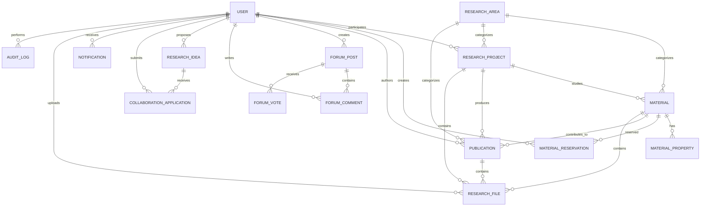
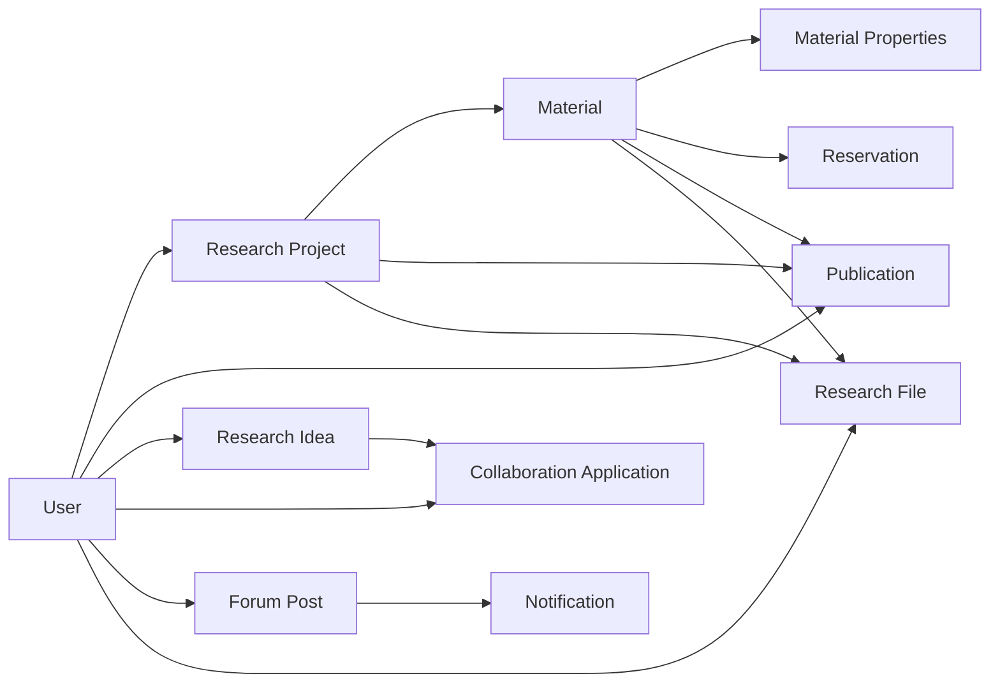

# CMRL Research Portal
## Database Schema Specification

**Project:** CMRL Research Portal  
**Laboratory:** CMRL — Crystalline Material Research Lab  
**Schema Version:** 1.0  
**Database:** MongoDB  
**ODM:** Mongoose  
**Based On:** `PRD.md` + `ARCHITECTURE.md`

---

# 1. Database Philosophy

The CMRL database should be designed around one central principle:

> **Research information must remain connected, searchable, traceable, and reusable.**

The most important relationships are:

```text id="9kvj1k"
Student
   ↓
Research Project
   ↓
Material
   ↓
DFT Properties
   ↓
Research Result
   ↓
Publication
```

The database must also preserve failed research:

```text id="d7a1dd"
Material
   ↓
Research Attempt
   ↓
Structural Instability
   ↓
Evidence
   ↓
Blacklisted / Archived
```

The schema should therefore prioritize:

- Data integrity
- Referential consistency
- Searchability
- Extensibility
- Auditability
- Scientific reproducibility
- Access control
- Reasonable MongoDB document size

---

# 2. Database Architecture

MongoDB will contain separate collections for major business entities.

Recommended collections:

```text id="e8c92j"
users
researchAreas
materials
materialProperties
materialReservations
researchProjects
publications
researchIdeas
collaborationApplications
forumPosts
forumComments
forumVotes
notifications
researchFiles
resources
announcements
achievements
auditLogs
```

Potential future collections:

```text id="ysb4w3"
alumniProfiles
researchMilestones
materialVersions
propertyDefinitions
tags
externalReferences
```

Not every future collection should be created in the MVP.

---

# 3. General MongoDB Conventions

Every major document should use:

```text id="xmy2ds"
_id
createdAt
updatedAt
```

Mongoose timestamps should be enabled where appropriate.

IDs exposed to users should generally not be raw MongoDB ObjectIds.

Use application-level identifiers where useful.

Examples:

```text id="xv7cyw"
User:
CMRL-USER-001

Material:
CMRL-MAT-001

Project:
CMRL-PROJ-001

Publication:
CMRL-PUB-001
```

MongoDB `_id` remains the internal database identifier.

---

# 4. ObjectId vs Public ID

Use both.

Example:

```json id="4h8w3x"
{
  "_id": "MongoDB ObjectId",
  "materialId": "CMRL-MAT-001"
}
```

The `_id` is used internally for relationships.

The public identifier is used for:

- URLs
- Human communication
- Lab documentation
- Research references

---

# 5. Users Collection

Collection:

```text
users
```

Purpose:

Store application-specific information associated with authenticated users.

Firebase Authentication remains responsible for authentication credentials.

---

## 5.1 User Schema

Conceptual structure:

```javascript id="d6jv4r"
{
  _id: ObjectId,

  firebaseUid: String,

  userId: String,

  role: String,

  accountStatus: String,

  rank: String,

  profile: {
    firstName: String,
    lastName: String,
    fullName: String,
    photoUrl: String,

    dateOfBirth: Date,
    gender: String,

    university: String,
    department: String,
    batch: String,

    email: String,
    mobile: String
  },

  researchProfile: {
    researchInterests: [String],
    bio: String,
    skills: [String],
    software: [String],
    programmingLanguages: [String]
  },

  externalProfiles: {
    linkedin: String,
    github: String,
    orcid: String,
    researchGate: String,
    googleScholar: String
  },

  privacy: {
    showDateOfBirth: Boolean,
    showGender: Boolean,
    showMobile: Boolean,
    showEmail: Boolean
  },

  createdAt: Date,
  updatedAt: Date
}
```

---

# 6. User Roles

Enum:

```text id="5w7kgq"
STUDENT
SUPERVISOR
ADMIN
ALUMNI
```

Future:

```text id="6gnx5w"
COLLABORATOR
GUEST_RESEARCHER
```

---

# 7. Account Status

Enum:

```text id="o8d7kn"
PENDING
ACTIVE
SUSPENDED
INACTIVE
```

Typical registration:

```text id="1b9z3x"
Register
 ↓
PENDING
 ↓
Admin Approval
 ↓
ACTIVE
```

---

# 8. User Rank

Enum:

```text id="qjv6ko"
NEWBIE
BEGINNER
INTERMEDIATE
ADVANCED
EXPERT
LEGEND
```

Rank should not be used as an academic qualification.

---

# 9. User Indexes

Recommended:

```text id="j2o9me"
Unique:
firebaseUid
userId
```

Additional indexes:

```text id="q0xjrf"
role
accountStatus
batch
researchProfile.researchInterests
```

Potential text/search indexes:

```text id="8yr0nq"
profile.fullName
profile.email
```

Avoid excessive indexes because every index increases write cost.

---

# 10. Research Areas Collection

Collection:

```text
researchAreas
```

Purpose:

Allow CMRL to create expandable research categories without hard-coding them into the frontend.

---

## 10.1 Schema

```javascript id="20kflg"
{
  _id: ObjectId,

  researchAreaId: String,

  name: String,

  slug: String,

  description: String,

  imageUrl: String,

  isActive: Boolean,

  createdAt: Date,
  updatedAt: Date
}
```

---

# 11. Research Area Examples

Initial records:

```text id="o7c7n2"
Computational Materials Science
Density Functional Theory
Hydrogen Storage Materials
Crystal Structure Analysis
Electronic Properties
Mechanical Properties
Thermodynamic Properties
Optical Properties
Magnetic Materials
Energy Materials
```

---

# 12. Materials Collection

Collection:

```text
materials
```

This is the most important collection in the system.

---

# 13. Material Schema

Conceptual structure:

```javascript id="z8t6j4"
{
  _id: ObjectId,

  materialId: String,

  name: String,

  formula: String,

  normalizedFormula: String,

  commonName: String,

  elements: [String],

  materialCategory: String,

  researchAreas: [
    ObjectId
  ],

  crystalStructure: {
    crystalSystem: String,
    spaceGroup: String,
    spaceGroupNumber: Number,
    prototype: String,

    latticeParameters: {
      a: Number,
      b: Number,
      c: Number,
      alpha: Number,
      beta: Number,
      gamma: Number
    },

    volume: Number,
    density: Number,

    atomicPositions: [
      {
        element: String,
        x: Number,
        y: Number,
        z: Number,
        occupancy: Number
      }
    ]
  },

  research: {
    status: String,

    project: ObjectId,

    projectGroupHead: ObjectId,

    firstAuthor: ObjectId,

    supervisor: ObjectId,

    researchers: [
      ObjectId
    ]
  },

  researchProgress: {
    percentage: Number,

    milestonesCompleted: Number,

    totalMilestones: Number
  },

  visibility: String,

  notes: String,

  createdBy: ObjectId,

  createdAt: Date,
  updatedAt: Date
}
```

---

# 14. Material Status

Enum:

```text id="j8v3cn"
PROPOSED
UNDER_REVIEW
AVAILABLE
RESERVED
STUDYING
COMPLETED
PUBLISHED
REJECTED
STRUCTURALLY_UNSTABLE
BLACKLISTED
ARCHIVED
```

Status transitions must be controlled by business logic.

---

# 15. Material Visibility

Enum:

```text id="3v2s2j"
PUBLIC
CMRL_MEMBERS
PROJECT_MEMBERS
SUPERVISOR_ONLY
ADMIN_ONLY
```

This allows sensitive research to remain private.

---

# 16. Material Category

Potential categories:

```text id="0w9aab"
METAL_HYDRIDE
COMPLEX_HYDRIDE
CHEMICAL_HYDRIDE
ADSORBENT
ALLOY
CERAMIC
SEMICONDUCTOR
ENERGY_MATERIAL
OTHER
```

The category system should be extensible.

---

# 17. Material Indexes

Critical indexes:

```text id="4myyph"
materialId: UNIQUE

normalizedFormula

name

research.status

research.project

research.researchers

crystalStructure.crystalSystem

crystalStructure.spaceGroupNumber

researchAreas

createdAt
```

Potential compound indexes:

```text id="z5ud2n"
{
  "research.status": 1,
  "crystalStructure.crystalSystem": 1
}
```

These support common dashboard/filter operations.

---

# 18. Material Duplicate Detection

Potential duplicate matching should consider:

```text id="1j6v8m"
Formula
Normalized Formula
Elements
Crystal System
Space Group
Prototype
Structure
```

The system should not automatically delete or reject records solely because of formula similarity.

Instead:

```text id="q4v8l5"
New Material
 ↓
Duplicate Search
 ↓
Potential Matches
 ↓
Researcher Review
 ↓
Continue / Cancel
```

---

# 19. Material Properties Collection

Collection:

```text
materialProperties
```

Properties are intentionally separated from the main Material document.

This avoids creating a huge material schema containing hundreds of optional fields.

---

# 20. Material Property Schema

Conceptual structure:

```javascript id="o4k8rf"
{
  _id: ObjectId,

  propertyId: String,

  material: ObjectId,

  category: String,

  propertyType: String,

  name: String,

  status: String,

  value: {
    numeric: Number,
    text: String,
    boolean: Boolean,
    array: [Number]
  },

  unit: String,

  uncertainty: Number,

  methodology: {
    code: String,
    functional: String,
    pseudopotential: String,
    cutoffEnergy: Number,
    kPointMesh: String,
    convergenceCriteria: String,
    spinPolarized: Boolean,
    spinOrbitCoupling: Boolean,
    hubbardU: Number,
    notes: String
  },

  dataFiles: [
    ObjectId
  ],

  figures: [
    ObjectId
  ],

  researcher: ObjectId,

  verifiedBy: ObjectId,

  verificationStatus: String,

  notes: String,

  createdAt: Date,
  updatedAt: Date
}
```

---

# 21. Why Properties Are Separate

A material may have:

```text id="b9b5q0"
Band Gap
DOS
PDOS
Bulk Modulus
Young's Modulus
Phonon
Optical Absorption
Hydrogen Adsorption
...
```

Another material may have only:

```text id="k7k2al"
Band Gap
DOS
Formation Energy
```

Embedding every possible property into `materials` would create a large sparse document.

Separating properties provides:

- Flexibility
- Easier updates
- Property-specific permissions
- Independent status
- Better extensibility
- Easier future analytics

---

# 22. Property Categories

Enum:

```text id="p0iqy4"
STRUCTURAL
COMPUTATIONAL
ELECTRONIC
MECHANICAL
THERMODYNAMIC
OPTICAL
MAGNETIC
HYDROGEN_STORAGE
OTHER
```

---

# 23. Property Status

Enum:

```text id="9h8ww0"
NOT_STUDIED
PLANNED
IN_PROGRESS
COMPLETED
FAILED
VERIFIED
PUBLISHED
```

---

# 24. Property Value Design

Not every scientific property is a simple number.

The system must support:

### Scalar

```text
Band Gap = 2.1 eV
```

### Text

```text
Magnetic ordering = Ferromagnetic
```

### Array

```text
Elastic constants = [...]
```

### Structured result

```text
Dielectric tensor = [...]
```

Therefore the schema should not assume every property is simply:

```text
value: Number
```

---

# 25. Property Definitions

For better long-term consistency, introduce a future collection:

```text
propertyDefinitions
```

Example:

```javascript id="s1om9b"
{
  propertyDefinitionId: "PROP-BAND-GAP",

  category: "ELECTRONIC",

  name: "Band Gap",

  slug: "band-gap",

  valueType: "SCALAR",

  defaultUnit: "eV",

  description: "...",

  isActive: true
}
```

This allows CMRL to define standardized properties.

---

# 26. Computational Methodology

DFT properties should preserve enough methodological information for reproducibility.

Store:

- DFT package
- Functional
- Pseudopotential
- Cutoff energy
- K-point mesh
- Convergence criteria
- Spin settings
- SOC
- Hubbard U
- Calculation type

This is important because:

> A numerical property without its calculation methodology may be scientifically incomplete.

---

# 27. Research Projects Collection

Collection:

```text
researchProjects
```

---

# 28. Project Schema

```javascript id="7i1l9f"
{
  _id: ObjectId,

  projectId: String,

  title: String,

  slug: String,

  description: String,

  researchAreas: [
    ObjectId
  ],

  supervisor: ObjectId,

  groupHead: ObjectId,

  researchers: [
    ObjectId
  ],

  materials: [
    ObjectId
  ],

  objectives: [
    String
  ],

  methodology: String,

  status: String,

  progress: Number,

  startDate: Date,

  expectedCompletionDate: Date,

  actualCompletionDate: Date,

  publications: [
    ObjectId
  ],

  files: [
    ObjectId
  ],

  createdBy: ObjectId,

  createdAt: Date,
  updatedAt: Date
}
```

---

# 29. Project Status

Enum:

```text id="g8q0cl"
PROPOSED
ACTIVE
PAUSED
COMPLETED
PUBLISHED
ARCHIVED
```

---

# 30. Project Membership

For MVP, project membership can be represented by:

```text
researchers: [ObjectId]
```

For more advanced requirements, introduce:

```text
projectMembers
```

with:

```text
project
user
role
joinedAt
leftAt
status
```

The second approach is preferable if CMRL needs to track individual project roles and history.

---

# 31. Recommended Project Member Model

Use a separate relationship collection if project management becomes important.

Example:

```javascript id="u4o7d2"
{
  project: ObjectId,
  user: ObjectId,

  role: "GROUP_HEAD",

  status: "ACTIVE",

  joinedAt: Date,
  leftAt: Date
}
```

Possible roles:

```text id="3a1fpr"
GROUP_HEAD
RESEARCHER
CONTRIBUTOR
SUPERVISOR
```

---

# 32. Material Reservation Collection

Collection:

```text
materialReservations
```

---

# 33. Reservation Schema

```javascript id="x4bl7k"
{
  _id: ObjectId,

  reservationId: String,

  material: ObjectId,

  student: ObjectId,

  project: ObjectId,

  purpose: String,

  requestedStartDate: Date,

  expectedCompletionDate: Date,

  status: String,

  reviewedBy: ObjectId,

  reviewedAt: Date,

  rejectionReason: String,

  expiresAt: Date,

  createdAt: Date,
  updatedAt: Date
}
```

---

# 34. Reservation Status

```text id="j6z9tr"
REQUESTED
APPROVED
ACTIVE
COMPLETED
REJECTED
CANCELLED
EXPIRED
```

---

# 35. Reservation Integrity

There must not be two active reservations for the same material.

The system should enforce this through:

- Business logic
- Database constraints/indexes where possible
- Transactions

A reservation request should not immediately overwrite the material record without validation.

---

# 36. Publications Collection

Collection:

```text
publications
```

---

# 37. Publication Schema

```javascript id="5xj7we"
{
  _id: ObjectId,

  publicationId: String,

  title: String,

  authors: [
    {
      user: ObjectId,
      name: String,
      authorOrder: Number
    }
  ],

  journal: String,

  doi: String,

  publicationDate: Date,

  year: Number,

  abstract: String,

  researchAreas: [
    ObjectId
  ],

  materials: [
    ObjectId
  ],

  projects: [
    ObjectId
  ],

  status: String,

  externalUrl: String,

  pdfFile: ObjectId,

  createdBy: ObjectId,

  createdAt: Date,
  updatedAt: Date
}
```

---

# 38. Publication Status

```text id="y8q15k"
MANUSCRIPT
SUBMITTED
UNDER_REVIEW
ACCEPTED
PUBLISHED
```

---

# 39. Publication Relationships

A publication may relate to:

- Multiple students
- Multiple materials
- Multiple projects
- Multiple research areas

Avoid copying entire material/project objects into the publication.

Use references.

---

# 40. Research Ideas Collection

Collection:

```text
researchIdeas
```

---

# 41. Research Idea Schema

```javascript id="v3j9m4"
{
  _id: ObjectId,

  researchIdeaId: String,

  title: String,

  description: String,

  proposer: ObjectId,

  researchAreas: [
    ObjectId
  ],

  materials: [
    ObjectId
  ],

  requiredSkills: [
    String
  ],

  requiredSoftware: [
    String
  ],

  collaboratorsNeeded: Number,

  expectedDuration: String,

  supervisor: ObjectId,

  status: String,

  deadline: Date,

  createdAt: Date,
  updatedAt: Date
}
```

---

# 42. Research Idea Status

```text id="o1n9y7"
OPEN
UNDER_REVIEW
FILLED
CLOSED
CANCELLED
COMPLETED
```

---

# 43. Collaboration Applications Collection

Collection:

```text
collaborationApplications
```

---

# 44. Collaboration Application Schema

```javascript id="q7t2x9"
{
  _id: ObjectId,

  applicationId: String,

  researchIdea: ObjectId,

  applicant: ObjectId,

  message: String,

  relevantSkills: [
    String
  ],

  status: String,

  reviewedAt: Date,

  reviewedBy: ObjectId,

  reviewerMessage: String,

  createdAt: Date,
  updatedAt: Date
}
```

---

# 45. Collaboration Status

```text id="t3x7b2"
APPLIED
UNDER_REVIEW
ACCEPTED
REJECTED
WITHDRAWN
ACTIVE
COMPLETED
```

---

# 46. Forum Posts Collection

Collection:

```text
forumPosts
```

---

# 47. Forum Post Schema

```javascript id="0w2e4m"
{
  _id: ObjectId,

  postId: String,

  author: ObjectId,

  title: String,

  body: String,

  type: String,

  tags: [
    String
  ],

  researchArea: ObjectId,

  relatedMaterial: ObjectId,

  relatedProject: ObjectId,

  voteScore: Number,

  answerCount: Number,

  acceptedAnswer: ObjectId,

  status: String,

  createdAt: Date,
  updatedAt: Date
}
```

---

# 48. Forum Post Type

```text id="a4p0x7"
QUESTION
DISCUSSION
ANNOUNCEMENT
```

---

# 49. Forum Post Status

```text id="y6x1ab"
ACTIVE
CLOSED
LOCKED
REMOVED
```

---

# 50. Forum Comments Collection

Collection:

```text
forumComments
```

Schema:

```javascript id="m7r3cy"
{
  _id: ObjectId,

  post: ObjectId,

  author: ObjectId,

  parentComment: ObjectId,

  body: String,

  status: String,

  createdAt: Date,
  updatedAt: Date
}
```

`parentComment` allows nested replies without requiring unlimited document nesting.

---

# 51. Forum Votes Collection

Collection:

```text
forumVotes
```

Schema:

```javascript id="4w1v6j"
{
  _id: ObjectId,

  user: ObjectId,

  post: ObjectId,

  vote: Number,

  createdAt: Date
}
```

Vote:

```text
1 = Upvote
-1 = Downvote
```

Unique constraint:

```text id="5z0t9v"
user + post
```

A user should only have one active vote per post.

---

# 52. Notifications Collection

Collection:

```text
notifications
```

---

# 53. Notification Schema

```javascript id="u5b8wq"
{
  _id: ObjectId,

  notificationId: String,

  recipient: ObjectId,

  type: String,

  title: String,

  message: String,

  relatedEntityType: String,

  relatedEntityId: ObjectId,

  actionUrl: String,

  isRead: Boolean,

  readAt: Date,

  createdAt: Date
}
```

---

# 54. Notification Types

Examples:

```text id="e3j4q1"
COLLABORATION_APPLICATION
COLLABORATION_ACCEPTED
COLLABORATION_REJECTED
FORUM_REPLY
FORUM_MENTION
MATERIAL_RESERVED
RESERVATION_APPROVED
RESERVATION_REJECTED
RESERVATION_EXPIRING
MATERIAL_STATUS_CHANGED
PROJECT_ASSIGNMENT
PROJECT_UPDATE
PUBLICATION_ADDED
ANNOUNCEMENT
```

---

# 55. Research Files Collection

Collection:

```text
researchFiles
```

---

# 56. Research File Schema

```javascript id="d4o6m7"
{
  _id: ObjectId,

  fileId: String,

  originalName: String,

  storageKey: String,

  mimeType: String,

  extension: String,

  size: Number,

  uploadedBy: ObjectId,

  material: ObjectId,

  project: ObjectId,

  publication: ObjectId,

  accessLevel: String,

  version: Number,

  parentFile: ObjectId,

  checksum: String,

  createdAt: Date,
  updatedAt: Date
}
```

---

# 57. File Access Levels

```text id="6i5b8p"
PUBLIC
CMRL_MEMBERS
PROJECT_MEMBERS
SUPERVISOR_ONLY
ADMIN_ONLY
```

---

# 58. File Types

Possible allowed file types:

```text id="3d7y8h"
CIF
POSCAR
CONTCAR
INPUT
OUTPUT
CSV
TXT
PDF
PNG
JPG
SVG
ZIP
PY
SH
OTHER
```

The final allowed list should be implemented using MIME type and extension validation.

---

# 59. File Versioning

If a file is updated:

```text id="z5e3yn"
Version 1
 ↓
Version 2
 ↓
Version 3
```

Do not overwrite the historical file if version history is important.

The `parentFile` field can link versions.

---

# 60. Resources Collection

Collection:

```text
resources
```

---

# 61. Resource Schema

```javascript id="c4b8v0"
{
  _id: ObjectId,

  resourceId: String,

  title: String,

  slug: String,

  description: String,

  category: String,

  tags: [String],

  url: String,

  file: ObjectId,

  author: ObjectId,

  accessLevel: String,

  isPublished: Boolean,

  createdAt: Date,
  updatedAt: Date
}
```

---

# 62. Resource Categories

Examples:

```text id="l6k8e4"
DFT
CASTEP
QUANTUM_ESPRESSO
VASP
CRYSTALLOGRAPHY
LINUX
PYTHON
ORIGIN
RESEARCH_METHODOLOGY
SCIENTIFIC_WRITING
PAPERS
OTHER
```

---

# 63. Announcements Collection

Collection:

```text
announcements
```

Schema:

```javascript id="p3x6y1"
{
  _id: ObjectId,

  announcementId: String,

  title: String,

  body: String,

  author: ObjectId,

  priority: String,

  targetAudience: String,

  isPublished: Boolean,

  publishAt: Date,

  expiresAt: Date,

  createdAt: Date,
  updatedAt: Date
}
```

---

# 64. Announcement Priority

```text id="z2p7kq"
LOW
NORMAL
HIGH
URGENT
```

---

# 65. Achievement Collection

Collection:

```text
achievements
```

Schema:

```javascript id="9k5m0x"
{
  _id: ObjectId,

  achievementId: String,

  title: String,

  description: String,

  type: String,

  recipient: ObjectId,

  project: ObjectId,

  publication: ObjectId,

  date: Date,

  imageUrl: String,

  isPublic: Boolean,

  createdAt: Date,
  updatedAt: Date
}
```

---

# 66. Achievement Types

Examples:

```text id="g2h5x7"
PUBLICATION
AWARD
SCHOLARSHIP
CONFERENCE
HIGHER_STUDIES
RESEARCH_MILESTONE
OTHER
```

---

# 67. Audit Logs Collection

Collection:

```text
auditLogs
```

---

# 68. Audit Log Schema

```javascript id="x6p2m1"
{
  _id: ObjectId,

  actor: ObjectId,

  action: String,

  entityType: String,

  entityId: ObjectId,

  previousData: Mixed,

  newData: Mixed,

  metadata: Mixed,

  ipAddress: String,

  userAgent: String,

  createdAt: Date
}
```

Sensitive information should not be unnecessarily copied into audit records.

---

# 69. Audit Actions

Examples:

```text id="7h2n8b"
USER_CREATED
USER_UPDATED
USER_ROLE_CHANGED
USER_SUSPENDED

MATERIAL_CREATED
MATERIAL_UPDATED
MATERIAL_STATUS_CHANGED
MATERIAL_BLACKLISTED

PROPERTY_CREATED
PROPERTY_UPDATED
PROPERTY_VERIFIED

RESERVATION_CREATED
RESERVATION_APPROVED
RESERVATION_REJECTED

PROJECT_CREATED
PROJECT_UPDATED

PUBLICATION_CREATED
PUBLICATION_UPDATED

FILE_UPLOADED
FILE_DELETED

FORUM_POST_REMOVED
USER_BANNED
```

---

# 70. Entity Relationship Overview



---

# 71. Core Relationship Model

The most important relationship chain is:

```text id="5mx2vh"
USER
 │
 ├── participates in
 ↓
PROJECT
 │
 ├── studies
 ↓
MATERIAL
 │
 ├── has
 ↓
MATERIAL PROPERTY
 │
 └── contributes to
 ↓
PUBLICATION
```

---

# 72. Reference Strategy

Use MongoDB ObjectId references for relationships.

Example:

```javascript id="f7s5g0"
{
  material: ObjectId("..."),
  project: ObjectId("..."),
  researcher: ObjectId("...")
}
```

Do not store full duplicated documents.

---

# 73. When to Embed Data

Embedding is appropriate for small, tightly coupled data.

Good examples:

```text id="2qk8c7"
User.profile
Material.crystalStructure
Publication.author entry
```

Avoid embedding:

```text id="h3y1m7"
All forum posts inside User
All properties inside Material
All projects inside User
All files inside Project
```

Large or independently changing entities should be referenced.

---

# 74. Material Property Modeling Decision

There are two possible designs.

## Option A

Embed all properties inside Material.

### Advantage

Simple retrieval.

### Disadvantage

Large, inflexible documents.

---

## Option B — Recommended

Separate `materialProperties`.

### Advantages

- Flexible
- Extensible
- Independent property status
- Better research tracking
- Easier verification
- Easier future property definitions

CMRL should use **Option B**.

---

# 75. Material Property Units

Every numeric property should support units where applicable.

Examples:

```text id="o9b2e5"
Band Gap → eV
Energy → eV
Cutoff Energy → eV
Lattice Constant → Å
Density → g/cm³
Bulk Modulus → GPa
Young's Modulus → GPa
Temperature → K
Hydrogen Capacity → wt%
```

Do not assume units from property names alone.

---

# 76. Scientific Data Integrity

For important numerical results, store:

- Value
- Unit
- Method
- Researcher
- Calculation status
- Verification status
- Date
- Related files

This allows a future researcher to understand where a number came from.

---

# 77. Property Verification

A property may be:

```text id="o1j6t9"
COMPLETED
```

without being:

```text
VERIFIED
```

Therefore:

```text id="l9g5rq"
Researcher Calculation
       ↓
Completed
       ↓
Supervisor / Authorized Reviewer
       ↓
Verified
```

This distinction should be preserved.

---

# 78. Research Notes

Research notes should not be stored as a single unlimited text field if they are expected to become a major feature.

For MVP, a simple `notes` field may be acceptable.

Future:

```text
researchNotes
```

with:

- Author
- Entity
- Note
- Date
- Visibility

---

# 79. Material Research History

Future versions should consider:

```text id="p4o8y7"
materialHistory
```

This would record:

- Status changes
- Researchers
- Property changes
- Reservations
- Research attempts

For MVP, audit logs can provide most of this functionality.

---

# 80. Material Reservation Conflict

A material may have multiple historical reservations:

```text id="k5w9j0"
Reservation 1 → Completed
Reservation 2 → Cancelled
Reservation 3 → Active
```

Only one should be active at a time.

Historical reservations must remain stored for research management and auditing.

---

# 81. User-to-Material Relationship

Do not permanently store:

```text
user.materials = [...]
```

as the sole source of truth.

Instead, derive relationships through:

- Projects
- Reservations
- Material researchers
- Publications

This avoids synchronization problems.

---

# 82. User-to-Project Relationship

For MVP:

```text
Project.researchers[]
```

can reference users.

For detailed membership:

```text
ProjectMember
```

should be introduced.

This is preferable when tracking:

- Group head
- Researcher
- Contributor
- Start date
- End date

---

# 83. Publication Author Modeling

Authors should be represented in author order.

Example:

```javascript id="1v8qf5"
authors: [
  {
    user: ObjectId("..."),
    name: "Student A",
    authorOrder: 1
  },
  {
    user: ObjectId("..."),
    name: "Student B",
    authorOrder: 2
  }
]
```

The `name` snapshot can preserve historical authorship information even if a user's profile changes.

---

# 84. Deletion Strategy

Do not automatically hard-delete research records.

For important entities, prefer:

```text id="e2f0q3"
isArchived
```

or:

```text
status = ARCHIVED
```

Examples:

- Materials
- Projects
- Publications
- Research files
- Research ideas

User accounts may be deactivated rather than deleted.

---

# 85. Soft Delete

For entities requiring soft deletion:

```javascript id="t6g9n2"
{
  isDeleted: Boolean,
  deletedAt: Date,
  deletedBy: ObjectId
}
```

Not every collection needs soft deletion.

---

# 86. Database Validation

Mongoose schemas should validate:

- Required fields
- Enums
- Numeric ranges
- URLs
- Email format
- ObjectId format
- Date consistency
- File metadata

Backend request validation should also be performed before database operations.

---

# 87. Important Numeric Validation

Examples:

### Research progress

```text
0–100
```

### Hydrogen capacity

Must not be negative.

### Cutoff energy

Must be positive.

### K-point dimensions

Must be positive integers.

### Temperature

Must be physically meaningful according to context.

Scientific validation should be implemented conservatively rather than enforcing assumptions that may not apply to every research method.

---

# 88. Database Index Strategy

Initial critical indexes:

```text id="z1v2c8"
users.firebaseUid UNIQUE
users.userId UNIQUE

materials.materialId UNIQUE
materials.normalizedFormula
materials.research.status
materials.research.project

materialProperties.material
materialProperties.category
materialProperties.status

projects.projectId UNIQUE
projects.status

reservations.reservationId UNIQUE
reservations.material
reservations.student
reservations.status

publications.publicationId UNIQUE
publications.doi UNIQUE where applicable

notifications.recipient
notifications.isRead

forumPosts.author
forumPosts.tags
forumPosts.createdAt

researchIdeas.proposer
researchIdeas.status

collaborationApplications.researchIdea
collaborationApplications.applicant
```

---

# 89. Compound Indexes

Potential compound indexes:

```text id="8m3a2y"
materials:
status + researchArea

reservations:
material + status

notifications:
recipient + isRead + createdAt

forumPosts:
tags + createdAt

projects:
status + supervisor
```

Indexes should be verified against real query patterns before adding many compound indexes.

---

# 90. Unique Constraints

Important unique values:

```text id="3f9r8m"
firebaseUid
userId
materialId
projectId
publicationId
reservationId
researchIdeaId
applicationId
fileId
notificationId
```

DOI should be unique when present.

---

# 91. Forum Vote Constraint

The combination:

```text id="8x4qk5"
user + post
```

must be unique.

This prevents one user from creating multiple active votes for the same post.

---

# 92. Collaboration Application Constraint

A student should normally only have one active application to the same research idea.

Recommended unique/partial constraint:

```text id="x8w1r6"
researchIdea + applicant + active application
```

---

# 93. Reservation Constraint

Only one active reservation should exist for a material.

The implementation should use:

- Partial unique index where supported
- Transaction
- Service-level conflict checking

---

# 94. Notification Cleanup

Notifications can become numerous.

Future strategy:

- Keep unread notifications indefinitely.
- Archive/delete old read notifications after a configured retention period.
- Keep important system notifications longer if needed.

---

# 95. Audit Log Retention

Audit logs should have a longer retention period than ordinary notifications.

They are important for:

- Research integrity
- Administrative accountability
- Debugging
- Security investigation

---

# 96. Database Backup

MongoDB must be backed up regularly.

At minimum protect:

- Users
- Materials
- Material properties
- Projects
- Publications
- Reservations
- Audit logs

Research files require separate backup/versioning.

---

# 97. Example Material Document

A simplified example:

```json id="x6y2s8"
{
  "_id": "ObjectId(...)",
  "materialId": "CMRL-MAT-001",
  "name": "Lithium Tellurium Hydride",
  "formula": "LiTeH3",
  "normalizedFormula": "LiTeH3",
  "elements": ["Li", "Te", "H"],
  "materialCategory": "COMPLEX_HYDRIDE",

  "crystalStructure": {
    "crystalSystem": "Cubic",
    "spaceGroup": "Example",
    "spaceGroupNumber": 1,
    "latticeParameters": {
      "a": 5.2,
      "b": 5.2,
      "c": 5.2,
      "alpha": 90,
      "beta": 90,
      "gamma": 90
    }
  },

  "research": {
    "status": "STUDYING",
    "project": "ObjectId(...)",
    "firstAuthor": "ObjectId(...)",
    "supervisor": "ObjectId(...)",
    "researchers": [
      "ObjectId(...)"
    ]
  },

  "researchProgress": {
    "percentage": 65,
    "milestonesCompleted": 13,
    "totalMilestones": 20
  },

  "visibility": "CMRL_MEMBERS",

  "createdAt": "Date",
  "updatedAt": "Date"
}
```

This is an architectural example, not a final scientific dataset.

---

# 98. Example Property Document

```json id="c9x2r1"
{
  "propertyId": "CMRL-PROP-001",

  "material": "ObjectId(...)",

  "category": "ELECTRONIC",

  "propertyType": "SCALAR",

  "name": "Band Gap",

  "status": "COMPLETED",

  "value": {
    "numeric": 1.82
  },

  "unit": "eV",

  "methodology": {
    "code": "CASTEP",
    "functional": "PBE",
    "pseudopotential": "Example",
    "cutoffEnergy": 500,
    "kPointMesh": "8x8x8"
  },

  "researcher": "ObjectId(...)",

  "verificationStatus": "UNVERIFIED",

  "createdAt": "Date",
  "updatedAt": "Date"
}
```

---

# 99. Example Reservation

```json id="u7v3w1"
{
  "reservationId": "CMRL-RES-001",

  "material": "ObjectId(...)",

  "student": "ObjectId(...)",

  "project": "ObjectId(...)",

  "purpose": "Study structural and electronic properties",

  "status": "ACTIVE",

  "requestedStartDate": "Date",

  "expectedCompletionDate": "Date",

  "expiresAt": "Date",

  "createdAt": "Date",
  "updatedAt": "Date"
}
```

---

# 100. Example Project

```json id="b8x1f3"
{
  "projectId": "CMRL-PROJ-001",

  "title": "First-Principles Study of Selected Hydrides",

  "researchAreas": [
    "ObjectId(...)"
  ],

  "supervisor": "ObjectId(...)",

  "groupHead": "ObjectId(...)",

  "researchers": [
    "ObjectId(...)"
  ],

  "materials": [
    "ObjectId(...)"
  ],

  "status": "ACTIVE",

  "progress": 60,

  "createdAt": "Date",
  "updatedAt": "Date"
}
```

---

# 101. Database Transaction Examples

Transactions should be considered for operations such as:

## Reservation approval

```text id="7h9d4m"
Verify reservation
 ↓
Verify material availability
 ↓
Update reservation
 ↓
Update material status
 ↓
Create notification
 ↓
Commit
```

If any required operation fails:

```text
Rollback
```

---

# 102. Material Completion Workflow

When a researcher completes a material:

```text id="v7c3p1"
Update Properties
       ↓
Calculate Progress
       ↓
Research Review
       ↓
Material → COMPLETED
       ↓
Notification
       ↓
Optional Publication
```

Do not automatically set a material to `PUBLISHED` merely because all properties are complete.

Publication is a separate research outcome.

---

# 103. Structural Instability Workflow

```text id="y4q9m2"
Material Studying
       ↓
Calculation
       ↓
Instability Detected
       ↓
Create Evidence
       ↓
Research Review
       ↓
STRUCTURALLY_UNSTABLE
       ↓
BLACKLISTED / ARCHIVED
```

The system should preserve the original research attempt.

---

# 104. Research Knowledge Preservation

The database should preserve:

- Who studied a material
- When it was studied
- What properties were calculated
- What methodology was used
- What failed
- Why it failed
- Which publication resulted
- Which files were produced

This transforms the database into a long-term institutional research archive.

---

# 105. Data Ownership Rules

### Student

Can modify:

- Own profile
- Own research idea
- Own forum content
- Permitted project data
- Own uploaded files

### Supervisor

Can modify/review:

- Research projects
- Research assignments
- Selected material records
- Publications
- Verification

### Admin

Can manage:

- All records
- Users
- Roles
- System configuration
- Moderation
- Audit access

Exact permissions will be finalized in `API_SPEC.md`.

---

# 106. Database Security

MongoDB must not be publicly accessible.

Only the backend server should connect to the production database.

Architecture:

```text id="d4t7k9"
Browser
  ↓
Express API
  ↓
MongoDB
```

Never:

```text
Browser
  ↓
MongoDB
```

---

# 107. Sensitive Data

Sensitive information includes:

- Firebase UID
- Personal phone numbers
- Private email
- Date of birth
- Internal research notes
- Private files
- Unpublished research

API responses should expose only fields appropriate to the user's role.

---

# 108. Schema Evolution

The database schema will evolve.

Use:

- Mongoose schema versioning where needed
- Migration scripts for breaking changes
- Backups before major migrations
- Backward-compatible API changes when possible

Do not manually edit production documents without a controlled process.

---

# 109. Data Migration Strategy

When changing schema:

```text id="r5x6n2"
Development
 ↓
Migration Script
 ↓
Test Dataset
 ↓
Staging
 ↓
Backup Production
 ↓
Production Migration
 ↓
Validation
```

---

# 110. Database Testing

Test:

- Required fields
- Unique constraints
- Enum values
- References
- Reservation conflicts
- Duplicate materials
- Property values
- User permissions
- Soft deletion
- Transaction behavior

---

# 111. Recommended Initial Collections

For MVP:

```text id="n6q3w7"
users
researchAreas
materials
materialProperties
materialReservations
researchProjects
publications
notifications
researchFiles
announcements
auditLogs
```

Phase 2:

```text id="e2c9v1"
researchIdeas
collaborationApplications
forumPosts
forumComments
forumVotes
resources
achievements
```

Future:

```text id="r4v8s0"
propertyDefinitions
projectMembers
materialVersions
researchNotes
alumniProfiles
externalReferences
```

---

# 112. Final Schema Relationship

The core system should ultimately behave as:



---

# 113. Final Database Principles

The CMRL database must:

1. Treat materials as first-class research entities.
2. Keep DFT properties extensible.
3. Preserve research history.
4. Prevent duplicate material reservations.
5. Connect researchers to projects.
6. Connect projects to materials.
7. Connect materials to publications.
8. Preserve failed research.
9. Protect private research.
10. Maintain auditability.
11. Support future scientific integrations.
12. Scale from dozens to thousands of materials.
13. Avoid unnecessarily large MongoDB documents.
14. Use references for independently evolving entities.
15. Use embedded documents for small tightly coupled data.
16. Preserve scientific methodology alongside numerical results.
17. Distinguish completed calculations from verified results.
18. Prefer archival/soft deletion for research records.

---

# 114. Next Documentation Stage

The next document should be:

# `API_SPEC.md`

It will translate this database architecture into the actual backend contract.

It should define:

- API conventions
- Authentication
- Authorization
- Request/response formats
- Error format
- Pagination
- Filtering
- Sorting
- `/users`
- `/materials`
- `/material-properties`
- `/reservations`
- `/projects`
- `/publications`
- `/research-ideas`
- `/collaborations`
- `/forum`
- `/notifications`
- `/files`
- `/resources`
- `/announcements`
- `/admin`
- Audit endpoints
- HTTP status codes
- Validation
- Security
- Example requests/responses

The API specification should be based directly on the schema above and should **not invent entities that don't exist in the database design without explicitly documenting the change**.