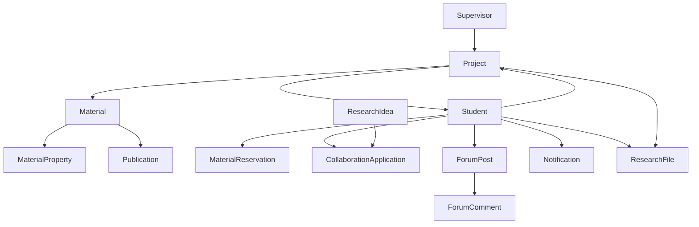
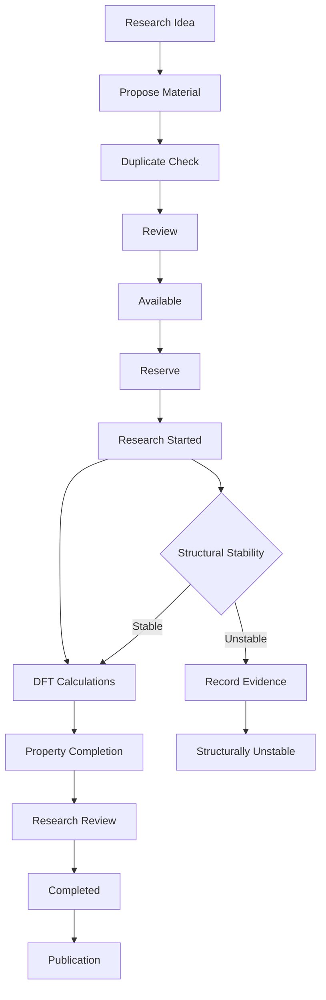

# CMRL Research Portal
## Product Requirements Document (PRD)

**Product:** CMRL Research Portal  
**Laboratory:** CMRL — Crystalline Material Research Lab  
**Document Version:** 1.0  
**Status:** Draft / Foundation Specification  
**Technology Direction:** MERN + Vite React + Firebase Authentication  
**Primary Users:** Students, Researchers, Supervisor, Administrators, Public Visitors

---

# 1. Executive Summary

CMRL Research Portal is a research-oriented web platform for the **Crystalline Material Research Lab (CMRL)**.

The platform will combine a professional public-facing laboratory website with an internal research management system.

Unlike a conventional laboratory website that primarily presents information about the lab, its supervisor, students, publications, and achievements, the CMRL Research Portal will function as the laboratory's **digital research infrastructure**.

The core purpose of the platform is to maintain a centralized database of materials studied by CMRL, track their computational/DFT properties, manage research projects, prevent duplicate material selection, facilitate student collaboration, preserve research knowledge, and provide tools for communication between researchers.

The platform will also provide:

- Student accounts
- Researcher profiles
- Supervisor and administrator management
- Material reservations
- DFT property tracking
- Structurally unstable material records
- Research projects
- Publications
- Research files
- Forum
- Collaboration opportunities
- Notifications
- Research dashboard
- Student ranking
- Alumni and achievement records
- Research resources

The system should be designed so that it can initially support dozens or hundreds of materials and researchers while remaining extensible enough to support thousands of material records in the future.

---

# 2. Product Vision

## Vision Statement

> **To create a centralized digital research ecosystem for CMRL where researchers can discover materials, track computational research, collaborate with one another, preserve research knowledge, and clearly communicate the laboratory's scientific contributions.**

The platform should eventually become the first place a CMRL researcher visits before beginning a new computational research project.

A student should be able to answer:

- Has this material already been studied?
- Is somebody currently studying it?
- Is the material available for research?
- Which properties have already been calculated?
- Which properties remain unexplored?
- Who is working on this material?
- Which projects are currently active?
- Has this material already produced a publication?
- Has another researcher already attempted this material and found it unstable?
- Who can help me with this calculation?
- Are there collaborators available for my research idea?

---

# 3. Problem Statement

Research groups can encounter several problems when research information is stored informally across:

- Personal computers
- Notebooks
- Messaging applications
- Google Drive folders
- Spreadsheets
- Personal files
- Individual students' knowledge

This can result in:

1. Multiple students selecting the same material.
2. Students being unaware of previous unsuccessful calculations.
3. Loss of research knowledge when students graduate.
4. Difficulty determining which material properties have been studied.
5. Difficulty monitoring ongoing projects.
6. Difficulty finding students with particular technical skills.
7. Difficulty finding research collaborators.
8. Fragmentation of research files.
9. Lack of centralized publication/project information.
10. Difficulty for the supervisor to monitor the laboratory's research activities.

CMRL Research Portal aims to address these problems through a centralized research information system.

---

# 4. Product Goals

## 4.1 Primary Goals

The system must:

1. Centralize CMRL material information.
2. Prevent duplicate material research.
3. Track material research status.
4. Track DFT properties.
5. Record structurally unstable materials.
6. Connect materials with researchers and projects.
7. Provide student research profiles.
8. Facilitate collaboration.
9. Provide research discussion facilities.
10. Provide a supervisor/admin research overview.
11. Preserve research knowledge.
12. Present CMRL professionally to external visitors.

---

## 4.2 Secondary Goals

The system should:

- Encourage research collaboration.
- Encourage knowledge sharing.
- Make research progress visible.
- Help new students understand previous research.
- Provide a central repository of useful resources.
- Showcase CMRL publications and achievements.
- Build a long-term digital research archive.

---

# 5. Non-Goals

The first version will NOT attempt to become:

- A full electronic laboratory notebook.
- A replacement for professional HPC management systems.
- A complete scientific calculation platform.
- A replacement for DFT software.
- A full academic journal management system.
- A social media platform.
- A general-purpose cloud storage service.
- An automated scientific discovery engine.

Advanced features may be considered in future versions.

---

# 6. Target Users

## 6.1 Public Visitor

A visitor who is not authenticated.

Typical users:

- Prospective students
- Researchers
- Other laboratories
- Universities
- Potential collaborators
- Academic visitors

They can view public information.

---

## 6.2 Student / Researcher

An authenticated CMRL member.

Students can:

- Manage profiles
- Search materials
- Reserve materials
- Participate in projects
- Update permitted research information
- Participate in the forum
- Create research ideas
- Apply for collaboration
- Upload permitted files
- View notifications
- Access resources

---

## 6.3 Supervisor

The supervisor is responsible for research oversight.

The supervisor can:

- Monitor projects
- Review materials
- Monitor students
- Review research progress
- Review research proposals
- View publications
- Approve selected actions

---

## 6.4 Administrator

The administrator manages the platform.

The administrator has full system management privileges.

---

## 6.5 Alumni

Former CMRL researchers.

Alumni may have limited authenticated access or public profiles depending on future implementation.

---

# 7. User Roles and Permissions

| Capability | Public | Student | Supervisor | Admin |
|---|---:|---:|---:|---:|
| View public website | ✓ | ✓ | ✓ | ✓ |
| View public materials | ✓ | ✓ | ✓ | ✓ |
| View student directory | Limited | ✓ | ✓ | ✓ |
| Edit own profile | — | ✓ | ✓ | ✓ |
| Reserve material | — | ✓ | ✓ | ✓ |
| Create research idea | — | ✓ | ✓ | ✓ |
| Apply for collaboration | — | ✓ | ✓ | ✓ |
| Forum participation | — | ✓ | ✓ | ✓ |
| Create project | — | Limited | ✓ | ✓ |
| Manage materials | — | Limited | ✓ | ✓ |
| Manage users | — | — | Limited | ✓ |
| Manage publications | — | Limited | ✓ | ✓ |
| Manage resources | — | Limited | ✓ | ✓ |
| Moderate forum | — | — | ✓ | ✓ |
| View audit logs | — | — | Limited | ✓ |
| System configuration | — | — | — | ✓ |

Exact permissions should be implemented through backend role-based authorization.

---

# 8. Authentication

Authentication will use **Firebase Authentication**.

## Supported methods

- Email/password
- Google/Gmail authentication

## Required functionality

- Registration
- Login
- Logout
- Email verification
- Password reset
- Persistent authentication
- Authentication state detection
- Protected routes
- Account suspension
- Role-based access control

Firebase UID will be used to associate the authentication account with the corresponding MongoDB user document.

---

# 9. User Data Architecture

Firebase should manage:

- Authentication identity
- Password authentication
- Google authentication
- Email verification

MongoDB should manage:

- User profile
- Research interests
- Academic information
- Projects
- Roles
- Rank
- Publications
- Forum activity
- Collaboration activity
- Other application-specific information

The frontend must never be trusted to determine authorization.

Backend authorization must verify the authenticated Firebase identity and associated role.

---

# 10. Public Website

The public website will represent CMRL externally.

## Main public pages

- Home
- About CMRL
- Supervisor
- Research Areas
- Facilities
- Projects
- Materials Database
- Publications
- Achievements
- Alumni
- Resources
- Contact

Public/private visibility must be configurable.

---

# 11. Homepage

The homepage should communicate the identity and research activities of CMRL immediately.

## Recommended sections

### 11.1 Hero

Display:

> **Crystalline Material Research Lab**

Supporting message describing computational materials research.

Visual identity should use concepts related to:

- Crystal structures
- Unit cells
- Lattice systems
- Computational materials
- DFT
- Electronic structures

---

### 11.2 About CMRL

Short introduction with a link to the complete About page.

---

### 11.3 Research Areas

Display major research fields.

---

### 11.4 Supervisor Spotlight

Display the supervisor's:

- Photograph
- Name
- Position
- Research interests
- Short biography

Link to full profile.

---

### 11.5 Research Statistics

Examples:

- Total Materials
- Active Projects
- Publications
- Researchers
- Completed Studies

---

### 11.6 Featured Materials

Display selected material records.

---

### 11.7 Current Research

Display active research projects.

---

### 11.8 Publications

Display recent publications.

---

### 11.9 Researchers

Display selected current students/researchers.

---

### 11.10 Research Opportunities

Display available projects/materials.

---

### 11.11 Collaboration

Invite researchers to explore collaboration opportunities.

---

# 12. About CMRL

The About page should contain:

- History
- Vision
- Mission
- Research philosophy
- Research methodology
- Research areas
- Facilities
- Computational resources
- Supervisor
- Major achievements
- Future objectives

---

# 13. Supervisor Profile

The supervisor should have a dedicated profile.

## Information

- Name
- Photograph
- Designation
- Department
- University
- Biography
- Academic background
- Research interests
- Research experience
- Publications
- Awards
- Supervised students

## External profiles

- ORCID
- Google Scholar
- ResearchGate
- LinkedIn

Citation metrics may be manually maintained initially.

External API integration can be considered later.

---

# 14. Research Areas

Research areas should be represented as database entities rather than hard-coded categories.

Possible initial areas:

- Computational Materials Science
- Density Functional Theory
- Hydrogen Storage Materials
- Crystal Structure Analysis
- Electronic Properties
- Mechanical Properties
- Thermodynamic Properties
- Optical Properties
- Magnetic Materials
- Energy Materials

Each research area can contain:

- Name
- Description
- Researchers
- Projects
- Materials
- Publications
- Resources

Administrators should be able to add additional research areas.

---

# 15. CMRL Material Database

The **Material Database is the core feature of the system.**

Every material receives a unique CMRL identifier.

Example:

`CMRL-MAT-001`

## Material identity

Each material should support:

- Material ID
- Material name
- Chemical formula
- Common name
- Composition
- Elements
- Material category

---

# 16. Crystal Structure Information

Material records should support:

- Crystal system
- Space group
- Space group number
- Prototype
- Lattice parameters
- Unit-cell volume
- Density
- Atomic coordinates
- Wyckoff positions
- Bond lengths
- Bond angles

Future support may include interactive 3D structure visualization.

---

# 17. Material Research Metadata

Each material should connect to:

- Research area
- Project
- Project group head
- First author
- Supervisor
- Researchers
- Date added
- Last updated
- Current status
- Research notes
- Publications

---

# 18. Material Lifecycle

The material lifecycle should be:

```text
Proposed
   ↓
Duplicate Check
   ↓
Under Review
   ↓
Available
   ↓
Reserved
   ↓
Studying
   ↓
Completed
   ↓
Published
```

Alternative path:

```text
Studying
   ↓
Structural Instability
   ↓
Evidence Recorded
   ↓
Rejected / Blacklisted
```

---

# 19. Material Statuses

Recommended statuses:

| Status | Meaning |
|---|---|
| Proposed | Suggested for research |
| Under Review | Being evaluated |
| Available | Available for a researcher |
| Reserved | Claimed by a researcher |
| Studying | Research currently underway |
| Completed | Research completed |
| Published | Research resulted in publication |
| Rejected | Research proposal rejected |
| Structurally Unstable | Calculation indicates instability |
| Blacklisted | Archived as unsuitable for future research |

Status transitions should be controlled according to user role.

---

# 20. Material Reservation System

The reservation system exists primarily to prevent duplicate research.

A student can select an available material and request a reservation.

## Reservation information

- Material
- Student
- Project
- Purpose
- Requested date
- Expected start date
- Expected completion date
- Status
- Approval information

Possible reservation states:

```text
Requested
↓
Approved
↓
Active
↓
Completed
```

Alternative:

```text
Requested → Rejected
Requested → Cancelled
Active → Expired
```

---

# 21. Reservation Rules

When a material is actively reserved:

- Other students should see that it is unavailable.
- The responsible researcher should be identifiable according to privacy settings.
- Supervisor/admin should be able to see reservation details.
- The reservation may have an expiry date.
- Expired reservations should return the material to an appropriate available state.
- Admin should be able to override reservations.

The system should prevent two active reservations for the same material.

---

# 22. Duplicate Material Detection

Before creating a new material, the system should check for potential duplicates.

Possible matching factors:

- Material formula
- Material name
- Element composition
- Crystal structure
- Space group
- Existing Material ID

The system should warn:

> A similar material already exists in the CMRL database.

Duplicate detection should be treated as a warning/review mechanism rather than blindly rejecting every similar record.

---

# 23. DFT Property System

The property system must support many computational properties.

It must be extensible because future CMRL research may require properties that are not known during the initial implementation.

Properties should be grouped into categories.

---

# 24. Structural Properties

Possible properties:

- Lattice constants
- Unit-cell volume
- Density
- Bond lengths
- Bond angles
- Space group
- Atomic positions

---

# 25. Computational Parameters

Store information such as:

- DFT code
- Exchange-correlation functional
- Pseudopotential
- Cut-off energy
- K-point mesh
- Smearing method
- Convergence criteria
- Spin polarization
- Spin-orbit coupling
- Hubbard U
- Calculation type
- Computational settings

---

# 26. Electronic Properties

Support:

- Band gap
- Band structure
- Density of states
- Partial density of states
- Fermi energy
- Charge density
- Electron localization function
- Bader charge

---

# 27. Mechanical Properties

Support:

- Elastic constants
- Bulk modulus
- Shear modulus
- Young's modulus
- Poisson ratio
- Pugh ratio
- Hardness
- Elastic anisotropy

---

# 28. Thermodynamic Properties

Support:

- Formation energy
- Cohesive energy
- Phonon dispersion
- Phonon DOS
- Gibbs free energy
- Entropy
- Heat capacity

---

# 29. Optical Properties

Support:

- Dielectric function
- Absorption coefficient
- Reflectivity
- Refractive index
- Extinction coefficient

---

# 30. Magnetic Properties

Support:

- Magnetic moment
- Magnetic ordering
- Spin polarization
- Magnetic configuration

---

# 31. Hydrogen Storage Properties

Because hydrogen storage may be an important CMRL research direction, support:

- Gravimetric hydrogen capacity
- Volumetric hydrogen capacity
- Hydrogen adsorption energy
- Hydrogen binding energy
- Dehydrogenation energy
- Hydrogen diffusion
- Storage mechanism
- Operating temperature
- Hydrogen release characteristics

---

# 32. Property Status

Each property should have an independent status.

Recommended:

- Not Studied
- Planned
- In Progress
- Completed
- Failed
- Verified
- Published

Visual indicators:

- Green = Completed
- Yellow = In Progress
- Gray = Not Studied
- Red = Failed
- Blue = Published

Status should not be communicated by color alone.

---

# 33. Material Detail Page

Each material should have a dedicated page.

Example URL:

`/materials/CMRL-MAT-001`

## Sections

1. Material identity
2. Status
3. Crystal information
4. Structure visualization
5. Project information
6. Researchers
7. First author
8. Supervisor
9. Research progress
10. Structural properties
11. Computational parameters
12. Electronic properties
13. Mechanical properties
14. Thermodynamic properties
15. Optical properties
16. Magnetic properties
17. Hydrogen-storage properties
18. Files
19. Publications
20. Research notes
21. Activity history

---

# 34. Research Progress

The material page should display an overall progress indicator.

Example:

```text
Research Progress
████████░░ 80%
```

The progress calculation should be based on configured research/property milestones rather than arbitrary manual percentages.

---

# 35. Structurally Unstable Material System

Materials that cannot be successfully studied because of structural instability should be preserved as research knowledge.

Each record should contain:

- Material
- Researcher
- Initial structure
- Calculation method
- Optimization result
- Phonon result
- Imaginary modes
- Decomposition information
- Instability reason
- Evidence
- Final conclusion
- Related files
- Notes
- Date

The purpose is to ensure future researchers do not repeat unsuccessful work unnecessarily.

---

# 36. Material Search and Filtering

The database must support powerful search.

## Search fields

- Material name
- Formula
- Material ID
- Element
- Space group
- Researcher
- Project
- Research area

## Filters

- Status
- Crystal system
- Research area
- Researcher
- Publication status
- Property status
- Hydrogen-storage capability

## Example query

A user should be able to find:

> Hydrides that are available for research and do not yet have phonon calculations.

---

# 37. Research Dashboard

The Research Dashboard should provide a high-level overview of CMRL's research.

## Statistics

- Total materials
- Available materials
- Reserved materials
- Materials being studied
- Completed materials
- Published materials
- Structurally unstable materials
- Active projects
- Researchers
- Publications

## Visualizations

- Materials by status
- Materials by research area
- Materials by crystal system
- Materials by researcher
- Research activity over time
- Property completion
- Publications over time

---

# 38. Research Projects

Each project should have:

- Project ID
- Title
- Description
- Research area
- Supervisor
- Group head
- Researchers
- Materials
- Objectives
- Methodology
- Start date
- Expected completion
- Status
- Progress
- Publications
- Files
- Notes

## Project statuses

- Proposed
- Active
- Paused
- Completed
- Published
- Archived

---

# 39. Student Profile

Each student should have:

## Personal information

- Profile picture
- Full name
- Date of birth
- Gender
- University
- Department
- Batch
- Email
- Mobile number

## Research information

- Research interests
- Current project
- Skills
- DFT packages
- Programming languages
- Research experience
- Publications
- Achievements

## External profiles

- LinkedIn
- GitHub
- ORCID
- ResearchGate
- Google Scholar

---

# 40. Privacy

Sensitive information should not automatically be public.

Potentially private:

- Date of birth
- Phone number
- Personal email

Potentially public:

- Name
- Research interests
- Research projects
- Publications
- Selected academic information
- Professional links

Students should have appropriate visibility controls.

---

# 41. Student Directory

The Student Directory should allow researchers to discover other CMRL members.

Search/filter by:

- Name
- Batch
- Research area
- Skills
- Project
- Rank

Profile cards should display:

- Photograph
- Name
- Rank
- Research area
- Current project
- Selected professional links

---

# 42. Rank and Reputation System

The system will include the proposed CMRL rank system:

```text
#Newbie
#Beginner
#Intermediate
#Advanced
#Expert
#Legend
```

The system should distinguish between:

### Community Rank

Based on activities such as:

- Forum contributions
- Helpful answers
- Collaboration
- Resource contributions
- Community participation

### Academic Achievement

Based on:

- Research projects
- Completed studies
- Publications
- Awards
- Research contributions

Community rank must not be presented as an indicator of academic superiority.

The initial implementation may allow admin-controlled promotion, with automated reputation scoring introduced later.

---

# 43. Forum

CMRL will have a lightweight technical discussion forum inspired by Reddit and Stack Overflow.

## Features

- Questions
- Answers
- Posts
- Comments
- Upvotes
- Accepted answers
- Tags
- Search
- Bookmarks
- Reports
- Moderation

## Categories

- DFT
- CASTEP
- Quantum ESPRESSO
- VASP
- Crystallography
- Materials Science
- Linux
- Python
- Origin
- Research Methodology
- General

---

# 44. Research Collaboration Hub

Students should be able to publish research ideas and find collaborators.

A research idea should contain:

- Title
- Description
- Research area
- Proposed methodology
- Required skills
- Required software
- Number of collaborators
- Expected duration
- Materials
- Supervisor
- Status

---

# 45. Collaboration Applications

Students can apply to research ideas.

Application lifecycle:

```text
Applied
 ↓
Under Review
 ↓
Accepted / Rejected
 ↓
Active
 ↓
Completed
```

The proposer should receive a notification when someone applies.

The applicant should receive a notification when their application status changes.

---

# 46. Notification System

The platform should have an in-app notification system.

Events include:

- Collaboration application
- Collaboration acceptance/rejection
- Forum reply
- Mention
- Material reservation
- Reservation approval/rejection
- Reservation expiry
- Material status change
- Project assignment
- Project update
- Publication addition
- Announcement

Notifications should support:

- Read/unread
- Timestamp
- Type
- Related entity
- Deep link

---

# 47. Publications

The publication system should contain:

- Title
- Authors
- First author
- Journal
- DOI
- Publication date
- Year
- Abstract
- Research area
- Materials
- Project
- Publication status
- External URL/PDF where appropriate

Statuses:

- Manuscript
- Submitted
- Under Review
- Accepted
- Published

Publications should connect to related:

- Materials
- Projects
- Researchers

---

# 48. Research File Repository

The platform should support research-related files.

Examples:

- CIF
- POSCAR
- CONTCAR
- DFT input files
- DFT output files
- DOS data
- Band structure data
- Figures
- Scripts
- Supporting documents
- Papers

## Access levels

- Public
- CMRL Members
- Project Members
- Supervisor/Admin Only

Files should have:

- Owner
- Upload date
- File type
- File size
- Related material/project
- Version
- Access level

---

# 49. Resources / Knowledge Base

Resources should include:

- DFT tutorials
- CASTEP tutorials
- Quantum ESPRESSO tutorials
- VASP tutorials
- Linux guides
- Python
- Origin
- Crystallography
- Research methodology
- Scientific writing
- Useful papers
- Useful websites

Resources should support categories and tags.

---

# 50. Alumni

The Alumni page should showcase former CMRL researchers.

Information may include:

- Name
- Batch
- Research topic
- Publications
- Higher studies
- Current institution
- Current position
- Achievements
- Professional links

---

# 51. Achievements

The platform should showcase:

- Publications
- Awards
- Scholarships
- Conference presentations
- Research milestones
- Higher-study achievements
- Major collaborations

---

# 52. Research Timeline

A visual timeline should document important CMRL milestones.

Examples:

- Laboratory establishment
- First project
- First publication
- Major research milestones
- Important awards
- Major collaborations
- Number of materials studied

---

# 53. Contact Page

The Contact page should contain:

- Laboratory location
- Department
- University
- Supervisor contact
- Official laboratory email
- Contact form
- Social media
- Map

Student personal contact details should not be displayed publicly by default.

---

# 54. Admin Dashboard

The Admin Dashboard should provide full management.

## User management

- Approve users
- Edit users
- Suspend users
- Delete users
- Change roles
- Change ranks

## Material management

- Add
- Edit
- Archive
- Blacklist
- Change status
- Approve reservations

## Project management

- Create
- Edit
- Assign researchers
- Monitor progress
- Archive

## Publication management

- Add
- Edit
- Delete
- Link to projects/materials

## Forum moderation

- Remove posts
- Remove comments
- Handle reports
- Suspend users

## Content management

- Announcements
- Resources
- Homepage content
- Public statistics

---

# 55. Supervisor Dashboard

The supervisor should receive a research-focused overview.

Important information:

- Active projects
- Students
- Research progress
- Material assignments
- Pending approvals
- Recently completed studies
- Publications
- Research ideas
- Structurally unstable materials

The dashboard should minimize unnecessary administrative details.

---

# 56. Audit Logs

Important system actions should be logged.

Examples:

- User created
- User role changed
- Material created
- Material status changed
- Material reserved
- Project created
- Property updated
- Publication added
- File uploaded
- User suspended

Audit records should include:

- Actor
- Action
- Entity
- Timestamp
- Previous value where relevant
- New value where relevant

Audit logs should be accessible to administrators.

---

# 57. Global Search

A global search should eventually search:

- Materials
- Students
- Projects
- Publications
- Forum
- Research ideas
- Resources

Search should support filtering and future fuzzy matching.

---

# 58. Announcements

Administrators should be able to publish announcements.

Examples:

- New publication
- Research opportunity
- Lab meeting
- Important deadline
- New material
- System maintenance

Announcements may appear:

- Homepage
- Student dashboard
- Supervisor dashboard
- Notification center

---

# 59. Security Requirements

The system must implement:

- Firebase Authentication
- Backend authorization
- Role-based access control
- Input validation
- API validation
- Rate limiting
- Secure file uploads
- File type validation
- File size limits
- XSS protection
- MongoDB injection prevention
- Secure CORS
- Environment variables
- Audit logging
- Account suspension

No secret credentials should be stored in the frontend.

Frontend role information must never be considered sufficient for authorization.

---

# 60. Privacy Requirements

The system must clearly distinguish public and private information.

Research files should default to restricted access unless explicitly marked public.

Unpublished research information should not automatically become publicly visible.

Student personal information must be protected.

---

# 61. Accessibility

The platform should support:

- Semantic HTML
- Keyboard navigation
- Accessible forms
- Screen-reader compatibility
- Clear focus states
- Appropriate contrast
- Alt text
- Error messages

Status must not depend solely on color.

---

# 62. Responsive Design

The platform must support:

- Desktop
- Laptop
- Tablet
- Mobile

Large material tables should have an appropriate mobile representation rather than simply overflowing horizontally whenever possible.

Dashboards should adapt to smaller screens.

---

# 63. SEO

Public pages should support:

- Page titles
- Meta descriptions
- Open Graph metadata
- Search-engine-friendly URLs
- Sitemap
- Robots.txt
- Canonical URLs

Authenticated pages should not be indexed.

---

# 64. Performance Requirements

The system should support growth from dozens to thousands of material records.

Use:

- Pagination
- Lazy loading
- Image optimization
- API caching where useful
- Database indexes
- Debounced search
- Efficient MongoDB queries
- Code splitting
- Optimized file delivery

Large datasets must never require downloading the entire database to the browser.

---

# 65. Suggested Core Entities

The conceptual data model should contain at least:

```text
User
Material
MaterialProperty
ResearchProject
Publication
ResearchIdea
CollaborationApplication
ForumPost
ForumComment
Notification
ResearchFile
MaterialReservation
ResearchArea
Achievement
Resource
Announcement
AuditLog
```

The exact schema will be defined in a separate `DATABASE_SCHEMA.md`.

---

# 66. Conceptual Relationship



---

# 67. Research Workflow

The intended research workflow is:



---

# 68. User Stories

## Student

### Material discovery

> As a student, I want to search the material database so that I can determine whether a material has already been studied.

### Material reservation

> As a student, I want to reserve an available material so that another researcher does not unknowingly start the same project.

### Property tracking

> As a student, I want to see which properties have already been calculated so that I know what research remains.

### Collaboration

> As a student, I want to publish a research idea so that I can find collaborators with complementary skills.

### Forum

> As a student, I want to ask technical questions so that other researchers can help me solve computational problems.

---

## Supervisor

> As a supervisor, I want to see active projects so that I can monitor research progress.

> As a supervisor, I want to see material assignments so that I can identify potential duplicate research.

> As a supervisor, I want to review proposed materials so that research directions remain aligned with laboratory objectives.

---

## Administrator

> As an administrator, I want to manage material records so that the database remains accurate.

> As an administrator, I want to manage user roles so that access to sensitive information is controlled.

> As an administrator, I want to see audit logs so that important system changes are traceable.

---

## Public Visitor

> As a visitor, I want to learn about CMRL's research so that I can understand the laboratory's scientific work.

> As a visitor, I want to view publications and achievements so that I can evaluate CMRL's research output.

---

# 69. Acceptance Criteria

## Material Search

**Given:** A user is viewing the material database.

**When:** The user searches for a formula or material name.

**Then:**

- Matching materials are returned.
- Results are paginated.
- Status is displayed.
- Material ID is displayed.
- User can open the material detail page.

---

## Material Reservation

**Given:** A student is authenticated and a material is available.

**When:** The student submits a valid reservation request.

**Then:**

- The reservation is stored.
- The material's availability changes appropriately.
- The student receives confirmation.
- Appropriate administrators/supervisors are notified.
- Another student cannot create a conflicting active reservation.

---

## Property Status

**Given:** A material contains multiple research properties.

**When:** A user opens the material detail page.

**Then:**

- Every property displays its status.
- Completed properties are clearly identifiable.
- Unstudied properties are clearly identifiable.
- Failed calculations are distinguishable from unstudied calculations.

---

## Collaboration Application

**Given:** A research idea is accepting collaborators.

**When:** A student applies.

**Then:**

- An application is created.
- The proposer receives a notification.
- The applicant can see the application status.
- The proposer can accept/reject the application.

---

## Role Security

**Given:** A student attempts to access an administrator endpoint.

**When:** The request reaches the backend.

**Then:**

- The backend rejects the request.
- The frontend cannot bypass the restriction.

---

# 70. UI/UX Principles

The interface should be:

- Clean
- Scientific
- Professional
- Data-oriented
- Responsive
- Easy to navigate

The system should prioritize information hierarchy over decoration.

Use:

- Tables
- Cards
- Tabs
- Filters
- Status badges
- Search
- Charts
- Progress indicators

Avoid excessive:

- Animations
- Gradients
- Glassmorphism
- Decorative elements
- Stock laboratory imagery

---

# 71. CMRL Visual Identity

The design should be inspired by:

- Crystal lattices
- Unit cells
- Molecular geometry
- Scientific visualization
- Computational grids

Potential motifs:

- Cubic lattice
- Hexagonal lattice
- Atomic nodes
- Connected structures
- Subtle scientific grid

The design should feel like a modern computational materials research platform.

---

# 72. MVP Scope

The first production version should focus on the core research workflow.

## MVP features

### Authentication

- Firebase authentication
- Email/password
- Google login
- Protected routes
- Roles

### Users

- Student profiles
- Student directory
- Admin user management

### Materials

- Material database
- Material detail page
- Material status
- DFT property tracking
- Search/filter
- Material reservation
- Structurally unstable materials

### Research

- Projects
- Publications
- Research dashboard

### Administration

- Admin dashboard
- Supervisor dashboard
- Audit logs

### Public Website

- Home
- About
- Supervisor
- Research Areas
- Publications
- Achievements
- Contact

---

# 73. Phase 2

After MVP:

- Forum
- Collaboration Hub
- Notifications
- Research file repository
- Resources
- Alumni
- Advanced filtering
- Announcements
- Reputation system

---

# 74. Phase 3

Advanced features:

- Interactive 3D crystal viewer
- Advanced material search
- External scientific database integration
- ORCID integration
- DOI/Crossref integration
- Advanced analytics
- Automated research statistics
- HPC integration
- AI-assisted research tools

---

# 75. Development Roadmap

## Milestone 1 — Foundation

- Repository
- Project architecture
- Environment configuration
- Firebase
- MongoDB
- Authentication

## Milestone 2 — Users

- User model
- Profiles
- Roles
- Protected routes
- Student directory

## Milestone 3 — Materials

- Material model
- CRUD
- Search
- Filters
- Status system

## Milestone 4 — Research Properties

- Property architecture
- Property categories
- Property status
- Material progress

## Milestone 5 — Reservation

- Reservation workflow
- Approval
- Conflict prevention
- Expiration

## Milestone 6 — Projects

- Project management
- Researcher assignment
- Material linking
- Progress tracking

## Milestone 7 — Publications

- Publication management
- Material/project relationships

## Milestone 8 — Dashboards

- Student dashboard
- Supervisor dashboard
- Admin dashboard
- Research analytics

## Milestone 9 — Community

- Forum
- Collaboration
- Notifications

## Milestone 10 — Public Website

- Homepage
- About
- Supervisor
- Research
- Achievements
- Contact

## Milestone 11 — Security and Testing

- Authorization testing
- API testing
- UI testing
- Security testing
- Responsive testing

## Milestone 12 — Deployment

- Production database
- Backend deployment
- Frontend deployment
- Domain
- CI/CD
- Monitoring

---

# 76. Testing Strategy

Testing should include:

## Unit testing

Test:

- Utility functions
- Business logic
- Validation
- Permission logic

## API testing

Test:

- Authentication
- Authorization
- CRUD
- Validation
- Error handling

## Integration testing

Test:

- Firebase → backend
- Backend → MongoDB
- Material → project
- Material → reservation
- Student → collaboration

## End-to-end testing

Test complete workflows:

```text
Register
→ Login
→ Complete profile
→ Search material
→ Reserve material
→ Start project
→ Update property
→ Complete research
→ Add publication
```

---

# 77. Deployment Strategy

A practical initial architecture:

```text
User
  ↓
React + Vite
  ↓
Backend API
  ↓
Express + Node
  ↓
MongoDB
```

Authentication:

```text
React
  ↓
Firebase Authentication
  ↓
Firebase UID
  ↓
Backend authorization
```

Research files should use dedicated object/file storage rather than storing large files directly inside MongoDB.

The deployment architecture should prioritize low cost, reliability, and simplicity for the initial version.

---

# 78. Architecture Recommendations

## TypeScript

**Recommendation: Use TypeScript.**

Although JavaScript would be simpler initially, this project contains many related entities:

- Users
- Materials
- Properties
- Projects
- Publications
- Reservations
- Collaborations
- Notifications

TypeScript will reduce errors as the project grows.

---

## State Management

**Recommendation: Zustand for client-side global state.**

Use React local state for local UI behavior and Zustand for shared application state such as:

- Authentication state
- User profile
- Notifications
- Selected filters where appropriate

Do not put every piece of state into a global store.

---

## API

**Recommendation: REST API for MVP.**

REST is simpler and well suited to the application's entity-based architecture.

GraphQL can be considered later if the data relationships become sufficiently complex to justify it.

---

## Database

**Recommendation: MongoDB + Mongoose.**

MongoDB is appropriate because:

- Material properties can vary.
- Research entities evolve.
- Property categories may expand.
- The project is already planned around MERN.

However, schema validation and indexes must still be carefully designed.

---

## Authentication

**Recommendation: Firebase Authentication.**

Use Firebase exclusively for authentication identity while keeping application profile data in MongoDB.

---

## Real-Time Notifications

For the MVP, notifications may initially be stored in MongoDB and fetched periodically.

Real-time updates can later use:

- Socket.IO
- Firebase mechanisms
- Server-sent events

Socket.IO is a reasonable future choice if the platform requires extensive real-time functionality.

---

## File Storage

Use object storage rather than MongoDB for large research files.

Possible options:

- Firebase Storage
- Cloudinary
- S3-compatible storage

The final choice should depend on deployment cost and file requirements.

---

## Search

MongoDB search/indexing is sufficient for the MVP.

A dedicated search engine can be introduced later if the database becomes very large.

---

# 79. Risks and Mitigations

## Risk: Duplicate materials

**Mitigation:**

- Search before creation
- Duplicate warnings
- Material IDs
- Reservation system
- Supervisor/admin review

---

## Risk: Incorrect scientific data

**Mitigation:**

- Clear ownership
- Edit history
- Verification status
- Supervisor review
- Audit logs

---

## Risk: Loss of research files

**Mitigation:**

- Dedicated file storage
- Backups
- File metadata
- Versioning

---

## Risk: Privacy leak

**Mitigation:**

- Access control
- Private-by-default research files
- Backend authorization
- Profile visibility settings

---

## Risk: Database complexity

**Mitigation:**

- Define schema before implementation
- Separate core entities
- Avoid unnecessary duplication
- Use consistent relationships

---

## Risk: Overengineering

**Mitigation:**

- Strict MVP
- Phase-based development
- Defer advanced features

---

# 80. Future Expansion

Potential future integrations include:

- ORCID
- Google Scholar
- Crossref
- DOI services
- Materials Project
- NOMAD
- PubChem
- Crystallography databases
- HPC systems

These should not block the MVP.

---

# 81. Product Success Criteria

The CMRL Research Portal will be considered successful when:

1. A student can quickly determine whether a material has already been studied.
2. Students can see which materials are currently available.
3. Duplicate research is significantly reduced.
4. Researchers can identify which DFT properties remain unstudied.
5. Structurally unstable materials are preserved as institutional knowledge.
6. Supervisors can understand current research activity from a dashboard.
7. Students can discover researchers with relevant skills.
8. Students can find collaborators for research ideas.
9. Research projects can be connected to materials and publications.
10. Important research information remains available after students graduate.
11. CMRL's research output can be presented professionally to external visitors.
12. The platform can scale beyond the initial number of materials and students.

---

# 82. Final Product Structure

The final platform can be conceptually divided into:

```text
                         CMRL
                          │
          ┌───────────────┴───────────────┐
          │                               │
   PUBLIC WEBSITE                    RESEARCH PORTAL
          │                               │
    About CMRL                      Materials
    Supervisor                      Projects
    Research Areas                  Properties
    Facilities                      Students
    Publications                    Reservations
    Achievements                    Collaborations
    Alumni                          Forum
    Contact                         Notifications
                                    Files
                                    Dashboard
                                    Resources
                                    Publications
                                          │
                                          ↓
                                  Research Knowledge
                                      Repository
```

The central relationship is:

```text
Student
   │
   ├──────────────┐
   ↓              ↓
Project       Collaboration
   │
   ↓
Material
   │
   ↓
DFT Properties
   │
   ↓
Research Results
   │
   ↓
Publication
```

---

# 83. Final Product Principle

CMRL Research Portal should not simply answer:

> **"Who are we?"**

It should answer:

> **"What are we researching, who is researching it, what has already been done, what remains to be done, what failed, and how can researchers work together?"**

The **Material Database**, **Research Dashboard**, **Project System**, and **Researcher Network** should therefore form the core of the product.

The public website should communicate CMRL's identity and achievements, while the authenticated portal should provide the actual research infrastructure.

---

# 84. Next Documentation Stage

The next document should be:

**`ARCHITECTURE.md`**

It should translate this PRD into a concrete technical architecture covering:

- Frontend architecture
- Backend architecture
- Firebase architecture
- MongoDB architecture
- Authentication flow
- Authorization flow
- Folder structure
- API architecture
- Service layer
- Middleware
- File storage architecture
- Notification architecture
- Deployment architecture
- Security architecture
- Data flow
- System diagrams
- Technology decisions
- Scalability strategy

It should **not yet define the detailed MongoDB schemas or API endpoint specifications**. Those should be handled in the documents that follow.